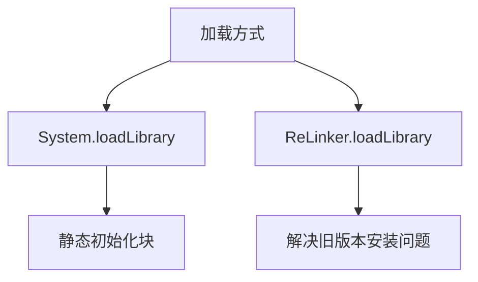
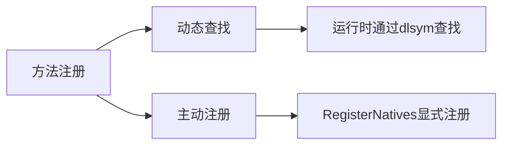
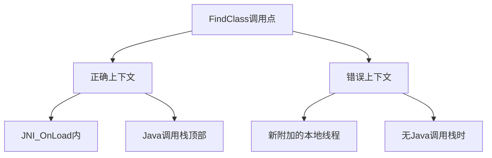

我将按照您的要求对这篇文章进行结构化解析和讲解：

### 核心内容总结
文章主要讲解了 Android 平台加载本地库（Native Libraries）的最佳实践，重点围绕以下三个方面：
1. 本地库的加载方式与可靠性问题
2. 本地方法注册的两种方式对比
3. JNI_OnLoad 的正确使用与类加载上下文问题

### 深入解析

#### 一、本地库加载机制


4. **基础方法**：
- `System.loadLibrary("fubar")` 加载 `libfubar.so`
- 应在静态初始化块中调用，保证早期加载
```kotlin
companion object {
    init {
        System.loadLibrary("fubar")
    }
}
```

5. **ReLinker 的作用**：
- 解决 Android 旧版本（4.x及以下）的安装问题：
  - 库文件损坏
  - 更新时残留旧版本
  - 多ABI支持问题
- 示例：`ReLinker.loadLibrary(context, "fubar")`

#### 二、本地方法注册的两种方式


6. **动态查找（dlsym）**：
- 遵循 JNI 命名规范：
  `Java_包名_类名_方法名`
- 缺点：
  - 方法签名错误在首次调用时才暴露
  - 需要导出所有符号
  - 容易发生符号冲突

7. **主动注册（RegisterNatives）**：
```cpp
static const JNINativeMethod methods[] = {
    {"nativeFoo", "()V", (void*)nativeFoo},
    {"nativeBar", "(Ljava/lang/String;I)Z", (void*)nativeBar}
};
env->RegisterNatives(c, methods, count);
```
- 优势：
  - 启动时立即验证方法存在性
  - 更好的符号控制（通过版本脚本）
  - 更小的二进制体积

#### 三、JNI_OnLoad 的完整实现
```cpp
JNIEXPORT jint JNI_OnLoad(JavaVM* vm, void* reserved) {
    // 1. 获取JNIEnv指针
    JNIEnv* env;
    if (vm->GetEnv((void**)&env, JNI_VERSION_1_6) != JNI_OK) {
        return JNI_ERR;
    }

    // 2. 查找目标类（关键上下文）
    jclass clazz = env->FindClass("com/example/MyClass");
    if (!clazz) return JNI_ERR;

    // 3. 注册本地方法
    static JNINativeMethod methods[] = {
        {"nativeMethod", "(I)V", (void*)nativeMethodImpl}
    };
    if (env->RegisterNatives(clazz, methods, 1) != JNI_OK) {
        return JNI_ERR;
    }

    // 4. 返回JNI版本
    return JNI_VERSION_1_6;
}
```

关键点解析：
8. **版本管理**：
- 必须返回 `JNI_VERSION_1_6` 等有效版本号
- 早期返回错误码会导致加载失败

9. **类加载上下文**：
- 在 `JNI_OnLoad` 中调用 `FindClass` 使用的是库的类加载器
- 在其他线程调用时可能使用系统类加载器，导致找不到应用类

#### 四、符号可见性控制
通过编译参数优化：
```bash
# 使用版本脚本（推荐）
-Wl,--version-script=exported_symbols.vers 

# 或者全局隐藏符号
-fvisibility=hidden
```

版本脚本示例（exported_symbols.vers）：
```
{
    global:
        JNI_OnLoad;
    local:
        *;
};
```

优势：
- 仅暴露必要的符号（JNI_OnLoad）
- 减少符号冲突风险
- 减小二进制体积约 10-20%

#### 五、类加载上下文陷阱


解决方案：
10. 在 `JNI_OnLoad` 中预加载并缓存常用类
11. 对于需要跨线程使用的类：
```cpp
// 获取当前类加载器
jclass classLoaderClass = env->FindClass("java/lang/ClassLoader");
jmethodID getClassLoader = env->GetMethodID(classLoaderClass, "getClassLoader", "()Ljava/lang/ClassLoader;");
jobject loader = env->CallObjectMethod(yourClass, getClassLoader);

// 使用正确的类加载器
jclass targetClass = env->CallObjectMethod(loader, loadClassMethod, className);
```

### 实践建议
12. **库加载策略**：
- 优先使用静态初始化块
- 支持 Android 4.x 时集成 ReLinker

13. **方法注册选择**：
- 新项目推荐使用 RegisterNatives
- 遗留代码可逐步迁移

14. **错误处理**：
- 检查所有 JNI 调用的返回值
- 实现 `JNI_OnUnload` 释放资源

15. **调试技巧**：
```bash
# 查看导出符号
nm -D libfubar.so

# 检查未解析符号
readelf --dyn-syms libfubar.so | grep UND
```

通过这样的实现方式，既能保证本地方法的可靠性，又能优化应用的性能和稳定性。理解这些底层机制对于处理复杂的 JNI 交互、内存管理问题和多线程场景至关重要。