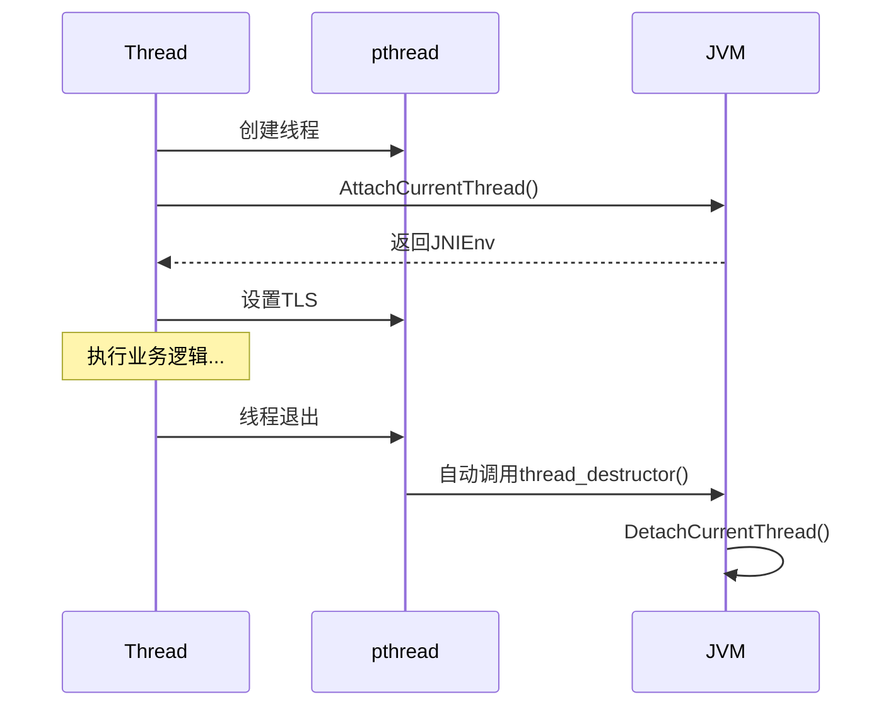
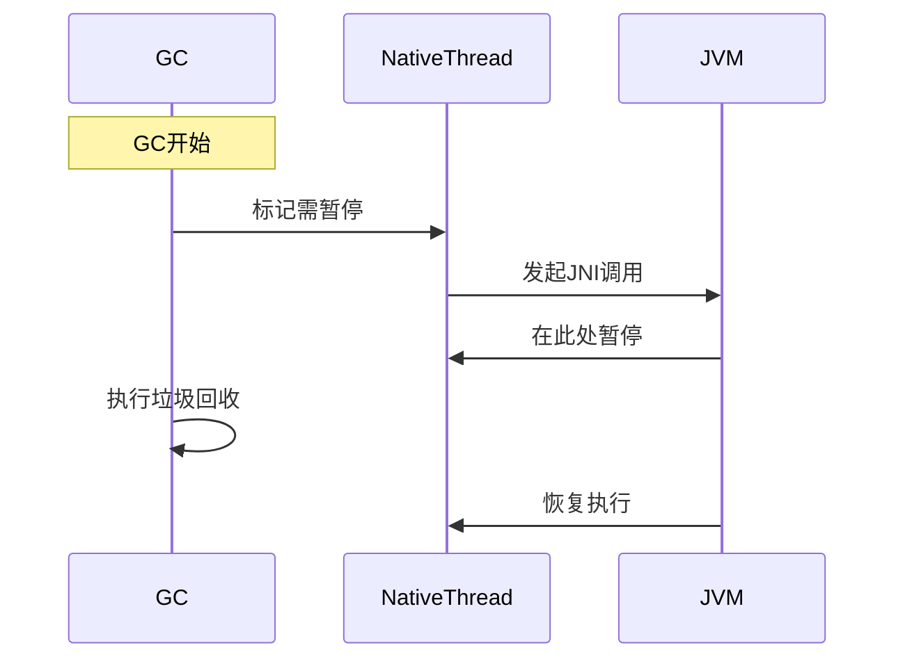

# JNI中的线程


好的，我将分步讲解这个主题，尽量做到深入本质又通俗易懂。以下是结构化的讲解：

---

### 一、核心脉络总结（先看这里把握全局）
1. **线程本质**：所有线程都是Linux内核线程
2. **两种创建方式**：
   - 推荐方式：Java的Thread.start()
   - 替代方式：pthread/std::thread + JNI附加
3. **关键问题**：
   - 未附加线程无法调用JNI
   - 必须detach防止内存泄漏
4. **最佳实践**：
   - 优先使用Java创建线程
   - 必须用Native线程时需严格管理生命周期
5. **底层机制**：
   - 附加线程会创建Java层的Thread对象
   - GC/调试器通过JNI调用点控制线程

---

### 二、本质原理剖析（理解为什么要这样做）

#### 1. Java线程与Native线程的关系


- **所有线程本质**：都是Linux pthread，由内核调度
- **关键区别**：
  - Java线程：自动关联Java环境（JNIEnv、ClassLoader等）
  - Native线程：没有Java环境，需手动附加

#### 2. JNIEnv的本质
- **线程本地存储**（TLS）：每个线程有独立的JNIEnv
- **访问权限**：类似"Java世界通行证"
- **生命周期**：
  - Attach：领取通行证
  - Detach：归还通行证

---

### 三、关键操作详解（配合代码示例）

#### 1. 附加线程（Attach）
```cpp
JavaVM* g_jvm; // 全局保存的JavaVM指针

void* native_thread_func(void* arg) {
    JNIEnv* env;
    // 附加当前线程
    jint result = g_jvm->AttachCurrentThread(&env, nullptr);
    if (result != JNI_OK) {
        // 错误处理
    }
    
    // 现在可以调用JNI方法了
    env->CallStaticVoidMethod(...);
    
    // 必须detach！
    g_jvm->DetachCurrentThread();
    return nullptr;
}
```

**关键点**：
- 每个线程必须单独附加
- Attach后会自动创建Java层的Thread对象
- 多次Attach是安全的（no-op）

#### 2. 自动Detach的推荐做法（Android 2.0+）
```cpp
// 定义线程本地存储key
static pthread_key_t thread_key;

// 析构函数（线程退出时自动调用）
void thread_destructor(void* env_ptr) {
    JNIEnv* env = static_cast<JNIEnv*>(env_ptr);
    if (env != nullptr) {
        g_jvm->DetachCurrentThread();
        pthread_setspecific(thread_key, nullptr);
    }
}

// 初始化代码（全局执行一次）
pthread_key_create(&thread_key, thread_destructor);

void* thread_func(void* arg) {
    JNIEnv* env;
    g_jvm->AttachCurrentThread(&env, nullptr);
    
    // 将env存入线程本地存储
    pthread_setspecific(thread_key, env);
    
    // ...线程业务逻辑...
    return nullptr;
}
```


**自动管理原理**：


---

### 四、为什么推荐使用Java创建线程？

#### 1. 环境完整性对比
| 特性                | Java线程           | Native线程附加       |
|---------------------|-------------------|---------------------|
| 栈空间              | 优化过的合适大小    | 可能过大或过小       |
| ThreadGroup         | 自动归属           | 强制放入main group   |
| ClassLoader         | 继承当前上下文      | 默认系统ClassLoader  |
| 异常处理            | 有UncaughtExceptionHandler | 直接崩溃          |
| 调试支持            | 名称可见于DDMS     | 需要手动设置         |

#### 2. 调试名称设置示例
Java侧：
```java
Thread myThread = new Thread() {
    public void run() {
        setName("MyJavaThread"); // 简单直观
    }
};
```

Native侧：
```cpp
// 需要获取pthread_t
pthread_t native_thread;
pthread_create(&native_thread, nullptr, thread_func, nullptr);

// 设置线程名（仅限Linux）
pthread_setname_np(native_thread, "MyNativeThread");

// 对于std::thread
std::thread stdThread(...);
pthread_setname_np(stdThread.native_handle(), "MyStdThread");
```

---

### 五、GC与线程暂停机制

#### 1. 关键行为
- **暂停触发点**：只在JNI调用时检查
- **Native代码执行**：不会被强制中断
- **调试器挂起**：同样遵循此规则

#### 2. 示例场景


---

### 六、必须Detach的原因（内存泄漏分析）

#### 1. 未Detach的后果
- Java层Thread对象泄漏
- 本地引用表积累
- 最终导致内存溢出

#### 2. 资源生命周期对比

| 操作     | Java线程 | Native线程（正确Detach） | Native线程（未Detach） |
| ------ | ------ | ------------------ | ----------------- |
| 线程对象   | 自动回收   | 自动回收               | 永远存在              |
| JNIEnv | 自动管理   | 正确释放               | 泄漏                |
| 本地引用   | 自动管理   | 需手动管理              | 积累泄漏              |

---

### 七、最佳实践总结

6. **优先选择**：
   ```java
   new Thread(() -> {
       // 需要调用Java的代码
   }).start();
   ```

7. **必须用Native线程时**：
   - 使用RAII模式管理Attach/Detach
   - 通过TLS自动Detach
   - 设置合理的线程栈大小

8. **调试技巧**：
   - 使用`pthread_setname_np`设置名称
   - 在Java层监控线程状态
   - 使用StrictMode检测未Detach

9. **性能注意**：
   - Attach/Detach有成本，避免高频操作
   - 长时间运行的Native线程才需要附加
   - 短期操作考虑通过Java线程回调

---

通过以上讲解，应该能够理解：Android通过强制管理JNI线程附加机制，既保证了Native代码的灵活性，又维护了Java虚拟机的内存安全和调试可视性。核心思想是"非托管环境必须显式管理资源"。