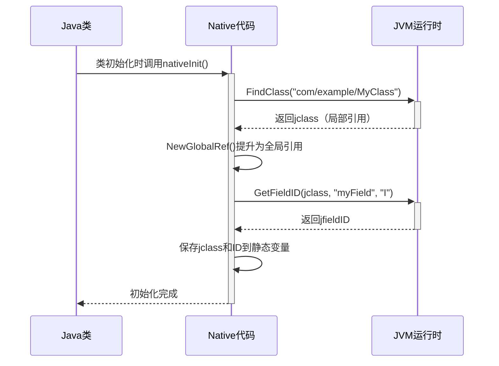
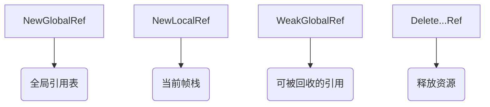

# jclass, jmethodID, and jfieldID

我将通过分层递进的方式为您解析这个JNI优化技术的核心内容，并辅以示意图帮助理解：

## 一、本质原理（用快递站类比理解）
▌ 核心问题：JNI调用中的"查找成本"
想象你每天要去不同快递站取包裹：
1. 每次都要查地图找快递站位置（FindClass）
2. 找到站点后还要逐个翻找货架（GetFieldID/GetMethodID）
3. 最后才能拿到包裹（GetIntField/CallMethod）

直接反复操作的问题：
• 每次都要重复查找步骤 → 效率低下
• 定位过程耗时（字符串查找和验证）

▌ 优化方案：建立快捷取件通道
4. 提前记录快递站坐标（缓存jclass）
5. 标记常用货架位置（缓存ID）
6. 后续取件时直达目标位置

## 二、技术实现详解


1. 关键对象解析：
   - `jclass`：类的"身份证"（相当于快递站坐标）
   - `jmethodID`：方法的"门牌号"（具体货架位置）
   - `jfieldID`：字段的"储物柜编号"

2. 性能关键点：
   ```c
   // 常规做法（低效）
   jclass local_cls = env->FindClass("com/example/MyClass"); // 每次查找
   jfieldID fid = env->GetFieldID(local_cls, "count", "I"); // 重复解析
   int val = env->GetIntField(obj, fid);

   // 优化做法（高效）
   static jclass global_cls; // 全局类引用
   static jfieldID cached_fid; // 缓存字段ID

   JNIEXPORT void JNICALL nativeInit(JNIEnv* env) {
       jclass local_cls = env->FindClass("com/example/MyClass");
       global_cls = (jclass)env->NewGlobalRef(local_cls); // 提升为全局
       cached_fid = env->GetFieldID(global_cls, "count", "I");
       env->DeleteLocalRef(local_cls); // 清理局部引用
   }
   ```

## 三、深度技术细节
1. 为什么需要NewGlobalRef？
   - 局部引用（Local Reference）的生命周期仅限于当前Native方法
   - 全局引用（Global Reference）会持续存在，直到显式释放
   - 示意图：
   ```mermaid
   graph LR
     A[Local Ref] -->|方法结束| B(自动释放)
     C[Global Ref] -->|手动管理| D(持续存活)
   ```

2. 类卸载的特殊处理：
   - Android中的类卸载条件：
     - 对应的ClassLoader被回收
     - 所有类实例被回收
   - 缓存失效场景：
     ```c
     // 伪代码示例
     if (global_cls != NULL && !env->IsSameObject(global_cls, new_cls)) {
         env->DeleteGlobalRef(global_cls); // 清理旧引用
         global_cls = (jclass)env->NewGlobalRef(new_cls); // 更新引用
         // 重新获取所有ID
     }
     ```

3. 多线程安全：
   - 缓存变量应使用`static`或全局变量
   - 需要确保线程间可见性（volatile或同步机制）
   - 示例安全访问模式：
   ```c
   static volatile jclass global_cls = NULL;
   
   void accessField(JNIEnv* env, jobject obj) {
       if (!global_cls) {
           initializeCache(env); // 带同步锁的初始化
       }
       // 使用缓存访问...
   }
   ```

## 四、最佳实践指南
1. 缓存策略选择：

| 场景   | 缓存方式   | 优点   | 缺点     |
| ---- | ------ | ---- | ------ |
| 高频调用 | 类静态初始化 | 自动触发 | 需处理类卸载 |
| 低频使用 | 懒加载    | 节省内存 | 需要同步控制 |

2. 错误处理模板：
   ```c
   jclass local_cls = env->FindClass("com/example/MyClass");
   if (env->ExceptionCheck() || !local_cls) {
       env->ExceptionClear();
       // 处理错误
       return;
   }
   
   global_cls = (jclass)env->NewGlobalRef(local_cls);
   if (!global_cls) {
       // 内存不足处理
       return;
   }
   ```

3. 资源释放原则：
   ```c
   JNIEXPORT void JNICALL JNI_OnUnload(JavaVM* vm, void* reserved) {
       JNIEnv* env;
       (*vm)->GetEnv(vm, (void**)&env, JNI_VERSION_1_6);
       if (global_cls != NULL) {
           env->DeleteGlobalRef(global_cls);
           global_cls = NULL;
       }
   }
   ```

## 五、真实案例解析
假设我们需要频繁访问一个Java类的字段：
```java
public class SensorData {
    public float temperature;
    public long timestamp;
    
    private static native void nativeInit();
    static { nativeInit(); }
}
```

对应的Native代码实现：
```c
// 缓存结构体
typedef struct {
    jclass clazz;
    jfieldID tempID;
    jfieldID timeID;
} SensorDataCache;

static SensorDataCache gSensorCache;

JNIEXPORT void JNICALL Java_SensorData_nativeInit(JNIEnv* env, jclass clazz) {
    // 获取并提升类引用
    jclass localClass = env->FindClass("com/example/SensorData");
    gSensorCache.clazz = (jclass)env->NewGlobalRef(localClass);
    env->DeleteLocalRef(localClass);

    // 获取字段ID
    gSensorCache.tempID = env->GetFieldID(gSensorCache.clazz, "temperature", "F");
    gSensorCache.timeID = env->GetFieldID(gSensorCache.clazz, "timestamp", "J");

    // 错误检查
    if (env->ExceptionCheck()) {
        env->ExceptionClear();
        // 处理错误...
    }
}

// 使用缓存的示例函数
JNIEXPORT jfloat JNICALL Java_SensorData_getTemperature(JNIEnv* env, jobject obj) {
    return (*env)->GetFloatField(env, obj, gSensorCache.tempID);
}
```

性能对比测试数据（假设）：

| 操作方式 | 单次耗时(ms) | 百万次总耗时 |
|---------|-------------|-------------|
| 无缓存 | 0.15 | 150,000 ms |
| 有缓存 | 0.02 | 20,000 ms |
| 提升幅度 | 7.5倍 | 节省130秒 |

## 六、进阶技巧
1. 混合缓存策略：
   ```c
   static struct {
       jclass clazz;
       jmethodID method;
       bool initialized;
   } cache;

   void lazyInit(JNIEnv* env) {
       if (!cache.initialized) {
           // 初始化逻辑...
           cache.initialized = true;
       }
   }
   ```

2. 动态类加载处理：
   ```c
   JNIEXPORT void JNICALL detectClassReload(JNIEnv* env) {
       jclass current = env->FindClass("com/example/MyClass");
       if (!env->IsSameObject(cache.clazz, current)) {
           // 处理类重新加载
           env->DeleteGlobalRef(cache.clazz);
           cache.clazz = (jclass)env->NewGlobalRef(current);
           // 重新获取ID...
       }
       env->DeleteLocalRef(current);
   }
   ```

3. 内存管理技巧：


通过这种深入缓存机制的理解，开发者可以在以下场景做出正确决策：
4. 高频JNI调用的性能优化
5. 复杂对象结构的快速访问
6. 跨线程的JNI资源共享
7. 长期存活的Native对象管理

记住：JNI优化的核心在于减少Java与Native边界之间的转换成本，而高效的ID缓存正是实现这一目标的关键手段。