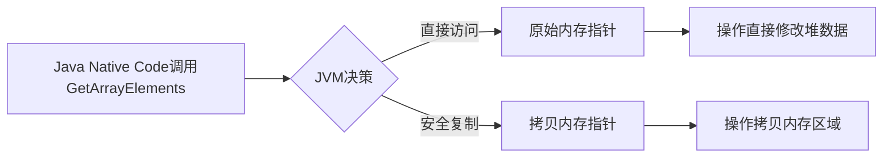
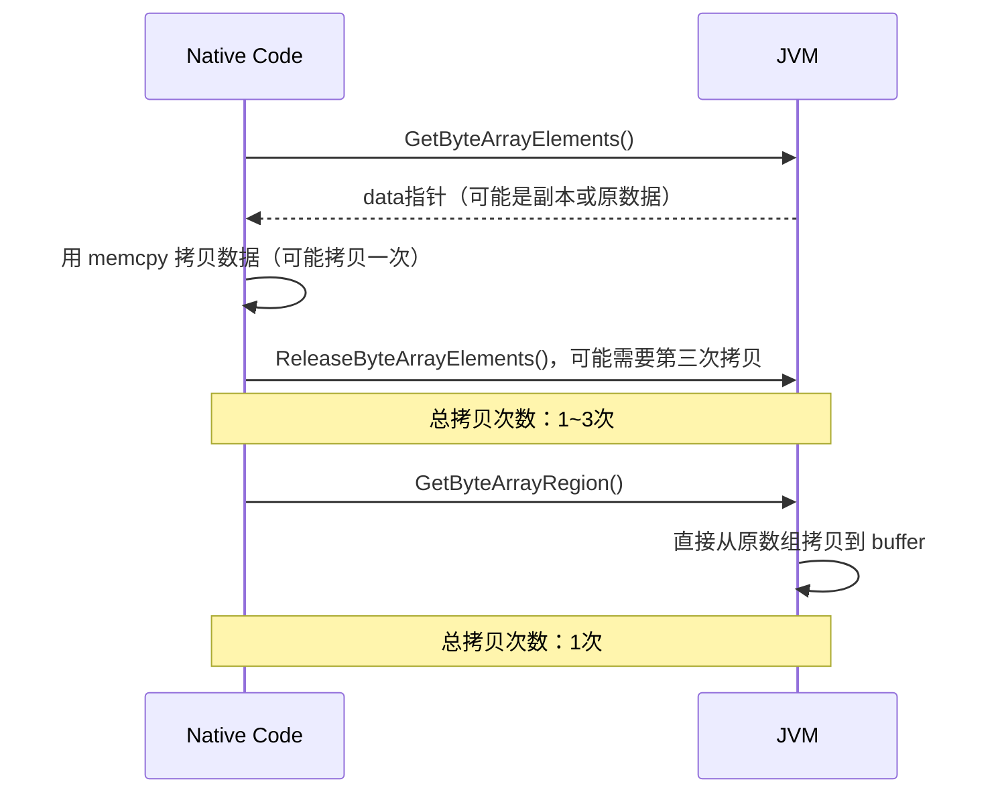

### 📚 JNI基础数组操作解析：原理与最佳实践

---

#### 一、核心要点总结
文章围绕JNI中对**Java基本类型数组的高效操作**展开。关键点如下：
1. **直接内存操作特性**：基本类型数组可通过JNI函数直接读写C层内存，对象数组需逐个访问。
2. **内存模型双态性**：获取数组指针时，JVM可能返回**原始内存地址**或**数据拷贝内存**。
3. **资源管理约束**：必须`Release`每个`Get`的操作，否则会导致内存泄漏或GC无法优化。
4. **释放模式三态调控**：通过`0/JNI_COMMIT/JNI_ABORT`精确控制内存变动行为。
5. **`isCopy`的隐藏作用**：虽很少显式使用，但对性能优化和容错处理至关重要。

**我理解了，如果是拷贝场景，就是类似于提交git到github上；如果是原始内存，就是直接在github的服务器上修改，改什么是什么**

---

#### 二、核心概念全景解剖

##### 🔄 **1. 内存访问模式的动态选择原理**



- **动态决策机制**：JVM根据当前堆的布局自动选择最高效的方式：
  - 若堆空间连续可锁定，返回原始指针（**零拷贝优化**）
  - 若存在GC移动风险，创建内存副本保障安全
- **内存锁定代价**：直接访问下数组会被"钉住"（Pinning），阻止GC的压缩操作，长期持有会造成内存碎片化。（即不让GC回收这片内存区域）

---

##### 🔧 **2. Release操作的本质**

**必须严格执行的配对操作**：
```cpp
jint* cArray = env->GetIntArrayElements(javaArray, &isCopy);
// ...操作数组...
env->ReleaseIntArrayElements(javaArray, cArray, mode);
```

| 操作阶段        | 内存状态变化               | GC影响               |
|-----------------|---------------------------|---------------------|
| Get成功返回指针 | 可能锁定堆或分配拷贝内存   | 锁定状态阻止堆压缩   |
| Release执行后   | 解锁堆 或 合并数据释放内存 | 恢复GC正常操作      |

**典型错误案例：**
```cpp
// !! 致命错误：假设未拷贝时就无需Release !!
if (isCopy == JNI_FALSE) {
    // 永不执行Release → 内存泄漏 + GC失效
} else {
    env->ReleaseIntArrayElements(...);
}
```

---

##### 🕹 **3. 释放模式的三元控制系统**

```cpp
// 三个关键模式定义
#define JNI_COMMIT  1 // 提交更改但不释放
#define JNI_ABORT   2 // 丢弃更改并释放
```


| 释放模式       | 原始内存场景       | 拷贝内存场景               |
| ---------- | ------------ | -------------------- |
| **0**      | 立即解除内存锁定     | 数据回写 + 销毁拷贝          |
| **COMMIT** | 无任何操作（NO-OP） | 数据回写但保留拷贝内存（可能下次还要用） |
| **ABORT**  | 解除锁定但不撤销修改   | 丢弃修改 + 立即释放拷贝        |
1. **操作原始数据时**：
    
    - 你的修改会立刻生效（直接改原文件）
    - COMMIT模式实际无意义（因为已经直连主打印机）
    - ABORT不会撤销修改（墨水已经印到纸上）
2. **操作拷贝数据时**：
    
    - 你的修改需要主动同步（用复制作业）
    - 模式0是标准操作（保修改+清场）
    - ABORT是"撤销按钮"，适合只读场景

**实战场景举例：**
```cpp
// 场景：临时读取数据无需修改
jbyte* buf = env->GetByteArrayElements(arr, NULL);
process(buf); // 读取操作
env->ReleaseByteArrayElements(arr, buf, JNI_ABORT); // 确保不触发无用回写
```

---

##### 🛠 **4. 关于isCopy的高级用法**

虽然通常无需关注，但在性能敏感场景有奇效：
```cpp
jboolean isCopy;
int* arrPtr = env->GetIntArrayElements(arr, &isCopy);

if (isCopy == JNI_TRUE) {
    // 操作拷贝内存时...
    // 可批量操作后一次性提交（避免频繁回写）
    bulk_process(arrPtr);
    env->ReleaseIntArrayElements(arr, arrPtr, 0); // 回写+释放
} else {
    // 操作原始内存时...
    // 需要实时提交每个修改（直接生效）
    iterative_update(arrPtr);
    env->ReleaseIntArrayElements(arr, arrPtr, JNI_COMMIT); 
}
```

---

#### 三、关键认知进阶指南

6. **为什么必须Release？**
   - **内存锁定代价**：即使返回原始指针，也需要让GC知道何时可回收内存区域
   - **线程安全保证**：防止多线程环境下的内存竞争问题
   - **跨平台一致性**：保证不同JVM实现的统一内存策略

7. **ABORT模式的核心价值**：
   - 当确定不需要保留修改时：
     - 避免冗余的内存复制（直接丢弃拷贝）
     - 减少不必要的内存总线占用（不触发回写操作）

8. **零拷贝优化的边界条件**：
   - 小数组（<1KB）通常直接复制更安全
   - 大数组（>8KB）倾向于返回原始指针
   - 可通过`-XX:MaxDirectMemorySize`调整策略

---

#### 四、实战代码范例精讲

```cpp
JNIEXPORT void JNICALL
Java_IntArrayProcessor_processNative(JNIEnv *env, jobject obj, jintArray arr) {
    jint *c_arr;
    jboolean is_copy;
  
    // 获取数组指针（自动决策复制策略）
    c_arr = (*env)->GetIntArrayElements(env, arr, &is_copy);
    if (c_arr == NULL) {
        return; // 内存不足时的防御性处理
    }
  
    // 核心处理示例：数值翻倍运算
    jsize len = (*env)->GetArrayLength(env, arr);
    for (int i=0; i<len; i++) {
        c_arr[i] *= 2; // 直接修改内存
    }
  
    // 选择性回写策略
    if (is_copy == JNI_TRUE) {
        // 拷贝数据时：强制回写并释放
        (*env)->ReleaseIntArrayElements(env, arr, c_arr, 0);
    } else {
        // 直接操作堆内存：确保解除锁定
        (*env)->ReleaseIntArrayElements(env, arr, c_arr, JNI_COMMIT);
    }
}
```

**代码诊断点：**
9. **NULL检查**：`Get`可能因为内存不足返回NULL
10. **回写策略自适应**：根据isCopy优化提交次数
11. **模式选择优化**：在原始内存时使用COMMIT避免重复锁定

---

#### 五、高频陷阱警示录

12. **幽灵锁问题**：
   ```cpp
   // 错误：跨越多个JNI调用时忘记释放
   static jint* globalPtr; // 全局缓存指针
   void init(JNIEnv *env) {
       globalPtr = env->GetIntArrayElements(...);
   }
   // 之后从未Release → 永久锁住堆内存
   ```

13. **异步操作异常**：
   ```cpp
   // 在回调线程中Release导致崩溃
   void callback_thread() {
       env->ReleaseIntArrayElements(...); // 错误：跨线程环境操作
   }
   ```

14. **ABORT误用灾难**：
   ```cpp
   // 误用ABORT导致数据丢失
   env->ReleaseIntArrayElements(arr, ptr, JNI_ABORT);
   // 后续又尝试使用已释放的ptr → 段错误
   ```

---

#### 六、最佳实践清单

15. **严格资源管理**：采用`Get/Release`配对的RAII模式
   ```cpp
   class JNIArrayGuard {
   public:
       JNIArrayGuard(JNIEnv* env, jarray arr) 
           : env_(env), arr_(arr), ptr_(env->GetArrayElements(...)) {}
       ~JNIArrayGuard() { 
           env_->ReleaseArrayElements(..., mode_); 
       }
       // ...其他操作符重载
   };
   ```

16. **防御性编程**：所有`Get`操作后立即检查NULL

17. **模式决策矩阵**：


| 操作类型     | 推荐模式                 |
| -------- | -------------------- |
| 读后不修改    | JNI_ABORT（确保修改操作尽量少） |
| 多次写后最终提交 | 0                    |
| 流式分阶段修改  | JNI_COMMIT + 最终0模式   |

---

通过将JNI数组操作机制与动态内存管理策略结合理解，开发者可以在安全性与性能之间找到最佳平衡点。记住：每个Get调用都是对JVM内存策略的一次契约签订，规范化的Release操作就是良好开发素养的直接体现！


# Region操作
有这些region：
![[Pasted image 20250207221859.png]]


### 文章核心提炼：
文章对比了 JNI 中两种操作数组数据的方式：传统 `Get/ReleaseArrayElements` 和更高效的 `Get/SetArrayRegion`，并分析后者的优势（避免多次拷贝、减少 JNI 调用、降低代码风险）。**核心结论**是：**当只需要一次性的数据拷贝操作时，使用 `Region` 系列函数更高效且更安全**。下文用技术本质 + 生活类比 + 代码对比展开。

---

### 技术本质与背景知识

#### 为什么需要 JNI 数据交互？
当 Java 和 C/C++（本地代码）交互时，需要通过 JNI（Java Native Interface）传递例如数组、字符串等数据类型。但问题是：
1. **Java 对象在堆内存中可能被 GC 移动**（例如 "CMS" 中的标记清除），直接操作指针可能不安全。
2. **数据拷贝是低效的**，如何减少无意义的重复拷贝是关键。

---

### 传统方法 vs Region 方法对比

#### 🌰 经典场景：从 Java 数组拷贝数据到 C 的 `buffer`
- **传统方法流程**：通过 `GetByteArrayElements` + `memcpy` + `ReleaseByteArrayElements`，隐含三次拷贝机会！

```cpp
// 传统方法（问题：潜在三次数据拷贝）
jbyte* data = env->GetByteArrayElements(array, NULL);
if (data != NULL) {
    memcpy(buffer, data, len);            // 第一次或第二次拷贝
    env->ReleaseByteArrayElements(array, data, JNI_ABORT);
}
```

- **Region 方法流程**：直接一次完成数据拷贝！

```cpp
// Region 方法（仅一次拷贝）
env->GetByteArrayRegion(array, 0, len, buffer); // 直接从 Java 数组到 buffer
```

#### 🔍 关键区别详解：
传统方法需要两步 JNI 调用（Get 和 Release），而 Region 方法一步到位。以下是两者流程对比：



---

### **为什么 Region 更快？**

#### 1. 传统方法的拷贝问题：
- **Get 阶段**：JVM **可能** 返回数组的副本（而非原数组指针），此时 `memcpy` 已是第二次拷贝。
- **Release 阶段**：如果数据被修改且需要写回，Release 会触发第三次拷贝。
- **JNI_ABORT 陷阱**：若使用 `JNI_ABORT` 参数释放数组，Release 将丢弃副本数据，最终只保留第一次拷贝的结果，此时总拷贝数为两次。

#### 2. Region 的优化路径：
直接在 JVM 内部完成数据移动，`buffer` 数据由 JVM **一次拷贝到位**，无中间数据副本生成，本质是 "剪切板" 式操作：

| 操作                | 传统方法               | Region 方法         |
|---------------------|------------------------|---------------------|
| JNI 调用次数        | 2（Get + Release）      | **1**              |
| 内存拷贝次数        | 1~3                    | **1**              |
| 内存锁定（Pinning） | 可能（限制 GC 移动）   | **无锁定**         |

#### 3. 风险对比：
- **忘记调用 Release**：传统方法如果未调用 `Release`，会导致内存泄漏或 JVM 崩溃。
- **异常处理困难**：在多个 JNI 调用之间处理异常更容易出错。

---

### **技术细节延伸**

#### 为什么存在 "Pinning（内存锁定）"？
Java 数组内存可能被 JVM 的 GC 移动，导致本地代码持有的指针失效。为了解决这一问题：
- **Pinning**：JVM 临时 "钉住" 数组（禁止 GC 移动），允许直接通过指针访问。
- **Copy**：或返回一个数据副本，此时操作的是副本数据。

传统方法在 `GetArrayElements` 时由 JVM 决定使用 Pinning 还是 Copy，而 Region 方法**绕过这一过程**。

#### JNI_ABORT 的作用：
- 在 Release 时使用 `JNI_ABORT` 参数会**丢弃本地修改**，避免将修改写回到原数组（传统方法第三次拷贝的触发条件）。

---

### 扩展使用场景

#### 1. 写回数据到 Java 数组：
如果需将 `buffer` 数据写入 Java 数组的某个区域，使用 `SetArrayRegion`：

```cpp
env->SetByteArrayRegion(array, 0, len, buffer); // 将 buffer 拷贝到 Java 数组
```

#### 2. 操作字符串数据：
Java 的 `String` 是不可变对象，若需读取其内容，可使用类似的 Region 方法：
```cpp
char utfBuffer[256];
env->GetStringUTFRegion(jstr, 0, len, utfBuffer); // 复制字符串到 buffer
```

---

### 总结与最佳实践

1. **优先选择 Region 方法**：当操作是 "只读" 或 "一次写入" 时（例如网络传输、文件 I/O 的缓冲区填充）。
2. **传统方法的适用场景**：需要长时间或反复访问数组内容时（如视频帧处理循环）。
3. **错误预防**：Region 方法不需要配对 Release，避免资源泄漏。

#### 🛠️ 代码实战建议：
- **校验长度**：调用 Region 前检查 Java 数组长度与 `len` 是否匹配，避免越界。
- **异常检查**：Region 方法可能抛出 `ArrayIndexOutOfBoundsException`，需用 `ExceptionCheck()` 捕捉。

```cpp
if (env->ExceptionCheck()) {
    // 处理越界异常
    return;
}
env->GetByteArrayRegion(array, 0, len, buffer);
```