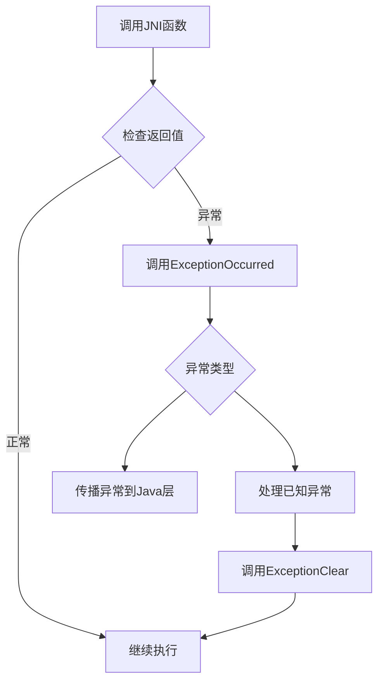
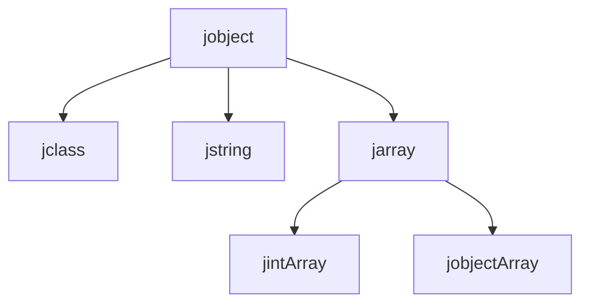
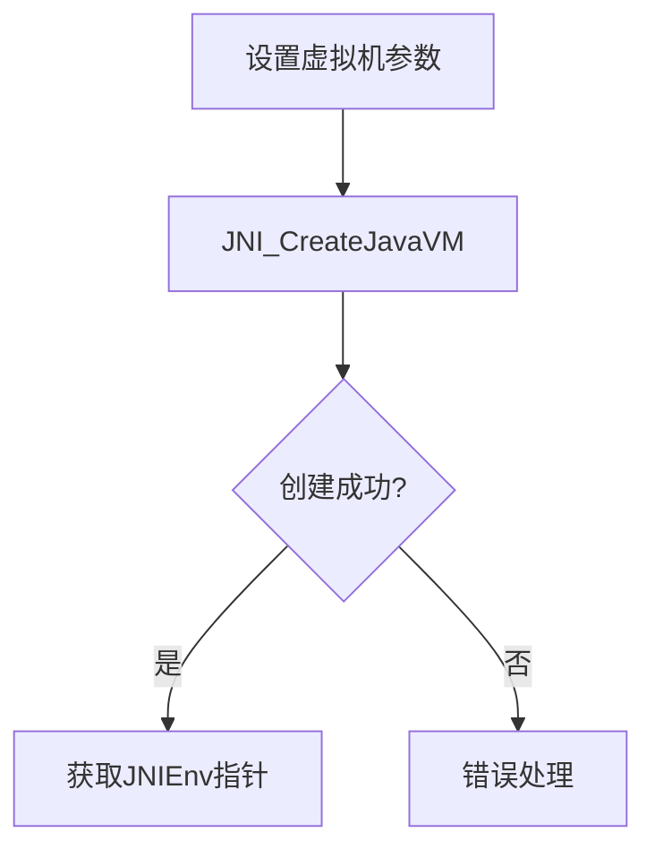

[java原声接口规范](https://docs.oracle.com/javase/7/docs/technotes/guides/jni/spec/jniTOC.html)

上述链接中，第四章类似于字典，有很多函数的解释
# 第二章讲了什么


我将结合章节内容，从七个核心机制为你解析JNI的运作原理和设计意图：

---
### 一、JNI接口的双指针设计：虚拟化的关键
**实现方式**：
![[Pasted image 20250207090235.png]]

JNIEnv** 是一个二级指针，实际上指向包含300+函数指针的结构体。这类似于C++的虚函数表，让不同的JVM实现自由替换底层函数。

**设计意图**：
1. 隔离名空间：通过间接调用实现Java与本地代码解耦
2. 多版本共存：调试版接口表可加入参数校验，生产版保持高效
3. 线程安全：每个线程独享接口指针，避免多线程竞争

**类比理解**：想象JNIEnv是餐厅的智能点餐平板，每次点菜（调用函数）都会根据当前所在分店（不同JVM实现）连接对应的厨房。

---
### 二、方法注册的双重机制
```java
// Java端注册
class DataProcessor {
    static { System.loadLibrary("data"); } 
    native void transform(int[] data);
}

// C端主动注册
JNINativeMethod methods[] = {
    {"transform", "([I)V", (void*)&nativeTransform}
};
env->RegisterNatives(env, cls, methods, 1);
```

**选择策略**：
- 动态加载：适合模块化开发，通过System.loadLibrary延迟绑定
- RegisterNatives：适合静态链接，实现早绑定

---
### 三、方法签名生成规则深度解析
**名称转义对照表**：

| 字符类型  | 转写规则            | 示例               |
|-----------|---------------------|--------------------|
| 包分隔符  | / → _               | com/example → com_example |
| Unicode   | _0xxxx              | 汉字 → _0e2b       |
| 特殊字符  | _1 → _, _2 → ; ...  | method_ → method_1 |

**重载解决方案**：
```cpp
// 原始方法：void process(String)
Java_pkg_Cls_process__Ljava_lang_String_2

// 重载方法：void process(int)
Java_pkg_Cls_process__I
```

**设计考量**：使用紧凑的签名编码，既保证跨平台统一性，又避免名称冲突。

---
### 四、对象生命周期管理模型
**引用类型对比**：

| 类型      | 作用域        | 释放方式       | 适用场景         |
|-----------|---------------|----------------|------------------|
| 局部引用  | 方法调用期间  | 自动/手动Delete | 临时对象处理     |
| 全局引用  | 跨调用持久化  | 手动Delete      | 缓存常用对象     |
| 弱引用    | 垃圾回收敏感  | 手动Delete      | 监听大型对象状态 |

**内存管理示例**：
```cpp
jobject localObj = env->NewLocalRef(...);
jobject globalObj = env->NewGlobalRef(localObj);

env->DeleteLocalRef(localObj); // 及时释放
// 后续可继续使用globalObj

env->DeleteGlobalRef(globalObj); // 最终必须释放
```

---
### 五、高效数据访问策略
**数组访问性能优化等级**：

4. **安全模式（拷贝）**：
```cpp
jint* safeArr = env->GetIntArrayElements(arr, NULL);
// 修改safeArr会自动同步到Java数组
env->ReleaseIntArrayElements(arr, safeArr, 0);
```

5. **极速模式（直接指针）**：
```cpp
jint* directArr = env->GetPrimitiveArrayCritical(arr);
// 禁用GC，切勿长时间持有！
env->ReleasePrimitiveArrayCritical(arr, directArr);
```

**选型建议**：小数组用拷贝模式保证安全，大数组（如10万+元素）使用直接指针但控制临界区时长。

---
### 六、异常处理标准流程



**关键检查点**：
```cpp
jmethodID mid = env->GetMethodID(...);
if (env->ExceptionCheck()) {
    env->ExceptionDescribe(); // 打印堆栈
    env->ExceptionClear();    // 必须清空异常
    return;                   // 终止后续操作
}
```

**异常传播示例**：
```cpp
try {
    // Java代码调用本地方法
} catch (Throwable e) {
    // JNI抛出的异常在此捕获
}
```

---
### 七、跨线程交互守则
**禁止行为列表**：
- 共享未保护的全局引用
- 在不同线程使用相同局部引用
- 跨线程传递JNIEnv指针

**正确做法**：
```cpp
// 在主线程创建全局引用
JavaVM* jvm;
env->GetJavaVM(&jvm);

// 工作线程中获取Env
JNIEnv* newEnv;
jvm->AttachCurrentThread((void**)&newEnv, NULL);

// 使用全局引用访问对象
newEnv->CallVoidMethod(globalObj, mid);
```

---
### 最终设计哲学总结：
JNI通过三个核心平衡实现跨平台高效交互：
6. **安全与性能平衡**：双阶段注册机制/数据访问多模式
7. **灵活与稳定平衡**：基于指针的函数表/严格的类型约束
8. **自动化与可控性平衡**：引用自动回收机制/手动控制接口

理解这些设计理念，能帮助开发者在处理JNI问题时做出符合框架预期的正确决策。


# 第三章讲了什么

## 一、为什么需要JNI类型映射？(核心意图)
当Java和C/C++两种语言交互时，就像中英翻译需要对照词典。由于两者内存模型和类型系统的差异：
- Java用虚拟机统一管理内存
- C直接操作物理内存
- Java有完整的面向对象类型体系
- C只有基础类型和指针

> 类比：就像中文的"书法"需要对应英文的"Calligraphy"，但各自的笔触细节不同，需要建立精确的对照关系

## 二、基础数据类型的映射


JNI制定了严格的基础类型对照表，本质上是在内存位宽维度建立对应：

| Java类型  | JNI类型      | 内存宽度 | 值域范围                 |
|---------|-------------|------|----------------------|
| boolean | jboolean    | 8位   | 0x00~0x01 (JNI_TRUE/FALSE) |
| byte    | jbyte       | 8位   | -128~127             |
| char    | jchar       | 16位  | 0~65535 (Unicode)    |
| int     | jint        | 32位  | -2^31 ~ 2^31-1       |
| long    | jlong       | 64位  | -2^63 ~ 2^63-1       |

> 现象级案例：Android游戏中Java层分数(int)传到C++引擎处理时需要转换为jint

## 三、对象引用体系的秘密


在JNI宇宙中，所有Java对象都可视作太空站(jobject)，不同类型的对接舱说明：
- C语言中：通过typedef强制类型别名，舱门外形相同但标识不同
```c
typedef jobject jclass;  // 教室舱门
typedef jobject jstring; // 字符舱门
```
- C++中：通过类继承严格分级，舱门类型不可互换
```cpp
class _jobject {};        // 基础舱门
class _jclass : public _jobject {}; // 授课专用舱
```

## 四、方法字段的"指纹识别"
字段和方法ID相当于生物特征密钥：
```c
// 非透明结构体指针
typedef struct _jmethodID *jmethodID; // 方法指纹
typedef struct _jfieldID *jfieldID;   // 字段指纹
```

使用场景示例（用户登录方法映射）：
```java
// Java层
public native boolean login(String user, String pwd);
```

```c
// C层实现
JNIEXPORT jboolean JNICALL
Java_UserManager_login(JNIEnv *env, jobject obj, 
                      jstring user, jstring pwd) {
    jclass cls = (*env)->GetObjectClass(env, obj);
    jmethodID method = (*env)->GetMethodID(env, cls, "login", 
                                         "(Ljava/lang/String;Ljava/lang/String;)Z");
    // 调用其他Java方法时使用该ID
}
```

## 五、万能集装箱jvalue
jvalue如瑞士军刀的统一接口，处理多种数据类型的传输：
```c
typedef union jvalue {
    jboolean z;  // 可装布尔值
    jdouble d;   // 可装双精度数
    jobject l;   // 也可运载对象
} jvalue;
```

应用场景：用于批量参数传递，像物流集装车一次运输多种货物
```c
jvalue args[2];
args[0].i = 100;        // 第一个参数是int
args[1].l = jobj;       // 第二个参数是对象
(*env)->CallVoidMethodA(env, obj, methodID, args);
```

## 六、类型签名系统
类型签名是JNI的摩尔斯电码，确保跨语言精确通信：

| 类型        | 签名       | 解码示例            |
|-----------|----------|-----------------|
| 方法签名      | (参数)返回类型 | (ILjava/lang/String;)V |
| int数组     | [I       | 表示int[]          |
| 自定义对象    | L包名/类名; | Ljava/lang/Object; |

逆向工程示例：
```
签名 "(I[Ljava/lang/String;J)V" 解析为：
参数列表：
- int
- String数组
- long
返回类型：void
```

## 七、编码的革命：Modified UTF-8
相比标准UTF-8的三大改进：

关键技术特性：
1. 空字符0x00用双字节0xC080表示，避免C字符串截断
2. 补充字符用6字节编码（标准UTF-8为4字节）
3. 兼容标准ASCII字符的单字节表示

解码示例（字符'€'）：
Unicode值：U+20AC
标准UTF-8：E2 82 AC
JNI Modified UTF-8：
11100010 10000010 10101100（同标准）

> Android系统通过GetStringUTFChars方法进行转换

## 八、设计哲学深度思考
4. **类型安全壁垒**：通过严格的类型映射防止内存误操作
5. **平台无关盔甲**：jint等类型确保不同CPU架构的一致性
6. **生命周期隔离**：局部引用与全局引用的设计
7. **性能最优路线**：方法ID缓存机制提升调用效率

## 九、典型应用陷阱
8. 错误处理：
```c
// 忘记检测异常
jclass cls = (*env)->FindClass(env, "not/exist/Class");
if (cls == NULL) {
    // 必须检测并处理异常
    return;
}
```

9. 字符编码雪崩：
```c
const char *str = (*env)->GetStringUTFChars(env, jstr, NULL);
// 使用后必须释放
(*env)->ReleaseStringUTFChars(env, jstr, str);
```

通过这种深入浅出的解析，开发者能透彻理解JNI如何搭建起Java与本地代码之间的类型桥梁，掌握跨语言交互的设计智慧。


# 第五章讲了什么？


### 深入透彻解析 JNI Invocation API

---

#### **核心功能**
**目标**：将 Java VM 嵌入到原生（C/C++）程序中，无需依赖 Java 虚拟机源码。
**典型场景**：开发混合 Java 和 C/C++ 的应用程序（如 IDE 核心、性能敏感的插件）。

---

### **关键概念与流程**
用代码示例详解核心步骤：

```cpp
#include <jni.h>  // JNI 头文件

int main() {
    JavaVM *jvm;          // 虚拟机实例指针
    JNIEnv *env;         // 线程相关的 JNI 环境指针
    JavaVMInitArgs vm_args; // 虚拟机初始化参数
  
    // 设置虚拟机选项（如类路径）
    JavaVMOption* options = new JavaVMOption[1];
    options[0].optionString = "-Djava.class.path=./my_classes";  // 关键路径！
  
    vm_args.version = JNI_VERSION_1_8;  // 指定 JNI 版本
    vm_args.nOptions = 1;
    vm_args.options = options;
    vm_args.ignoreUnrecognized = JNI_FALSE; // 严格检查参数
  
    // 1. 创建 Java VM（主线程自动附加）
    JNI_CreateJavaVM(&jvm, (void**)&env, &vm_args);
    delete[] options;
  
    // 2. 查找类并调用静态方法
    jclass cls = env->FindClass("Main");
    jmethodID mid = env->GetStaticMethodID(cls, "test", "(I)V");
    env->CallStaticVoidMethod(cls, mid, 100);
  
    // 3. 销毁 VM（需满足线程条件）
    jvm->DestroyJavaVM();
    return 0;
}
```

---

#### **核心步骤详解**
##### **1. 创建 Java VM**
- **核心函数**：`JNI_CreateJavaVM`
- **参数结构**：
  - `JavaVMInitArgs`：定义版本、选项（如类路径 `-Djava.class.path`）。
  - `JavaVMOption`：每个选项对应一个字符串（例如 `-Xmx512m` 设置堆内存）。



**注意事项**：
- `env` 指针仅在当前线程有效，多线程需单独附加（见下文）。
- **类路径**：必须明确指定 `.class` 文件的搜索路径。

---

##### **2. 调用 Java 方法**
- **步骤要点**：
  - `FindClass`：查找类（全限定名，如 `java/lang/String`）。
  - `GetMethodID`/`GetStaticMethodID`：获取方法或静态方法的 ID。
  - `CallStaticVoidMethod`：调用静态方法（参数通过 JNI 类型传递）。

**方法签名语法**：
- `(I)V` 表示参数为 `int`，返回类型为 `void`。
- [阅读 JNI 类型签名文档](https://docs.oracle.com/javase/8/docs/technotes/guides/jni/spec/types.html) 深入理解。

---

##### **3. 销毁 Java VM**
- **核心函数**：`DestroyJavaVM`
- **条件**：VM 会确保所有非守护线程结束后才会卸载。
- **错误处理**：若强行卸载，可能导致资源泄漏（如未释放的文件句柄）。

---

#### **多线程管理**
##### **线程附加与分离**
- **问题**：JNIEnv 是线程本地变量，原生线程需主动附加到 VM 才能使用 JNI。
- **实现**：
  - `AttachCurrentThread`：附加线程，获取 JNIEnv。
  - `DetachCurrentThread`：分离线程（必须在退出前调用）。

```cpp
JavaVM *jvm;  // 假设已初始化

void thread_func() {
    JNIEnv *env;
    jvm->AttachCurrentThread((void**)&env, NULL);
  
    // 在此执行 JNI 操作...
  
    jvm->DetachCurrentThread();
}
```

**类比**：进场需要领“工作证”，离场需归还，否则资源泄露。

---

##### **线程中的异常处理**
- **问题**：JNI 调用若抛异常，需显式检查和处理。
- **代码示例**：
```cpp
jclass cls = env->FindClass("NonExistentClass");
if (env->ExceptionCheck()) {
    env->ExceptionDescribe(); // 打印异常栈
    env->ExceptionClear();
    return;
}
```

---

#### **版本管理与本地库**
##### **JNI_OnLoad 和 JNI_OnUnload**
- **用途**：动态库加载和卸载时执行初始化/清理。
- **示例**：
```cpp
JNIEXPORT jint JNI_OnLoad(JavaVM* vm, void* reserved) {
    JNIEnv* env;
    vm->GetEnv((void**)&env, JNI_VERSION_1_8);
    // 声明所需 JNI 版本
    return JNI_VERSION_1_8;
}

JNIEXPORT void JNI_OnUnload(JavaVM* vm, void* reserved) {
    // 清理资源（避免调用复杂 Java 方法）
}
```

**关键点**：
- 若不实现 `JNI_OnLoad`，默认使用 JNI 1.1，无法使用新特性（如 1.2 的反射增强）。

---

#### **常见问题与解决方案**
##### 1. **类找不到（ClassNotFoundException）**
- **原因**：`-Djava.class.path` 未正确设置。
- **调试**：添加 `-verbose:class` 参数查看类加载日志。

##### 2. **线程未分离导致内存泄漏**
- **预防**：每个 `Attach` 必须配对 `Detach`，可用 RAII 模式封装。

##### 3. **跨线程共享 JNIEnv**
- **错误示例**：将 `env` 指针传给其他线程直接使用。
- **正确做法**：每个线程必须独立调用 `AttachCurrentThread` 获取自身 `env`。

---

### **总结**
- **Invocation API 本质**：是 C/C++ 与 Java 之间的桥梁，允许原生程序直接控制 JVM 生命周期和线程模型。
- **开发要点**：
  1. 严格管理线程的生命周期（附加/分离）。
  2. 明确类路径和 JNI 版本。
  3. 合理处理异常和资源释放。

**比喻**：使用 JNI Invocation API 就像是租用了一间“Java 工作室”，必须按规则办理入场手续，工作结束后需清理场地。


# 
# JNI的规范以及建议
源自官网，拓展自AI


您提到的这些准则是为了优化 JNI（Java Native Interface）层的性能和可维护性而提出的最佳实践。以下是对每条准则的详细解释，以及实际应用场景的分析：

---

### **1. 减少跨 JNI 层编组资源的次数**
**核心思想**：数据在 Java 和 C++ 之间的转换（编组）会产生性能开销，需尽量减少此类操作。

**具体策略**：
- **批量处理数据**：避免在 Java 和 C++ 之间频繁传递小数据块。例如，若需处理一个数组，应一次性传递整个数组，而非逐元素传递。
- **使用原始类型**：优先使用 `jint`、`jdouble` 等原始类型，而非复杂对象（如 `jstring` 或自定义对象），以减少序列化/反序列化开销。
- **内存共享**：通过 `ByteBuffer` 或直接内存（如 `malloc`/`NewDirectByteBuffer`）在 Java 和 C++ 间共享内存，避免数据拷贝。

**示例**：
```cpp
// C++ 处理 Java 传递的整型数组
JNIEXPORT jint JNICALL Java_MyClass_processArray(JNIEnv *env, jobject obj, jintArray arr) {
    jint *nativeArr = env->GetIntArrayElements(arr, NULL);
    jsize length = env->GetArrayLength(arr);
    // 一次性处理整个数组
    process(nativeArr, length);
    env->ReleaseIntArrayElements(arr, nativeArr, 0); // 释放资源
}
```

---

### **2. 避免跨语言的异步通信**
**核心思想**：异步逻辑尽量在单一语言内完成，避免 Java 和 C++ 线程间的复杂交互。

**具体策略**：
- **同语言线程管理**：若需在 C++ 中执行耗时操作并通过回调更新 Java UI，应由 Java 启动一个后台线程调用阻塞的 C++ 函数，完成后再通过 Java 线程通知 UI。
- **使用 Java 线程池**：在 Java 端管理线程生命周期，C++ 仅提供同步接口。

**反例**：
```cpp
// C++ 线程直接回调 Java 方法（复杂且易出错）
void cppWorkerThread(JNIEnv *env, jobject listener) {
    // 执行任务
    env->CallVoidMethod(listener, onCompleteMethod); // 需处理 JNIEnv 的线程绑定问题
}
```

**正例**：
```java
// Java 端管理异步逻辑
ExecutorService executor = Executors.newSingleThreadExecutor();
executor.submit(() -> {
    nativeBlockingCall(); // 阻塞的 C++ 调用
    runOnUiThread(() -> updateUI()); // 回到 UI 线程
});
```

---

### **3. 减少涉及 JNI 的线程数量**
**核心思想**：限制跨语言交互的线程数量，降低并发复杂度。

**具体策略**：
- **线程池隔离**：Java 和 C++ 各自维护线程池，仅通过池的管理者（如单一线程）进行跨语言通信。
- **避免工作线程直接跨 JNI**：例如 C++ 线程池完成任务后，将结果汇总到主线程，再由主线程通过 JNI 通知 Java。

**示例**：
```
Java 线程池  <--> [JNI 代理] <--> C++ 主线程 <--> C++ 工作线程
```

---

### **4. 集中管理接口代码**
**核心思想**：通过模块化和自动化，提高代码可维护性。

**具体策略**：
- **隔离 JNI 代码**：将 JNI 胶水代码集中在少量文件（如 `jni_bridge.cpp` 和 `NativeWrapper.java`）。
- **自动生成代码**：使用工具（如 Google 的 [JavaCPP](https://github.com/bytedeco/javacpp) 或 SWIG）生成 JNI 接口，减少手写错误。
- **接口抽象化**：在 Java 和 C++ 侧分别定义接口，通过 JNI 实现桥接。

**工具示例**：
```cpp
// 使用 JavaCPP 自动生成代码
#include <jni.h>
#include "MyClass.h"

using namespace javacpp;

JNIEXPORT void JNICALL Java_MyClass_nativeMethod(JNIEnv *env, jobject obj) {
    // 自动生成的代码直接调用 C++ 类
    MyClass::nativeMethod();
}
```

---

### **总结：优化维度与权衡**
| 维度                | 优化手段                           | 权衡因素                     |
|---------------------|-----------------------------------|----------------------------|
| **性能**            | 减少编组次数、共享内存             | 代码复杂度、内存安全性       |
| **可维护性**        | 集中管理接口、自动生成代码         | 工具链依赖、学习成本         |
| **并发复杂度**      | 限制跨语言线程通信                 | 灵活性、响应延迟             |

通过遵循这些准则，可以在性能、代码清晰度和长期维护性之间找到平衡。实际项目中，需根据具体场景（如高频调用、大数据传输或低延迟需求）调整优先级。


# `JNIEnv *env`是什么


**JNIEnv（Java Native Interface Environment）** 是 Java 本地接口（JNI）的核心概念之一，用于在本地代码（如 C/C++）中与 Java 虚拟机（JVM）交互。以下是逐步理解它的关键点：

---

### 1. **本质：指向函数表的指针**
   - **JNIEnv** 是一个指向 JNI 函数表的指针，本质是一个 `struct JNINativeInterface*`（C语言）或 `_JNIEnv` 类的实例（C++）。
   - 它提供了所有 JNI 函数的访问入口（如创建对象、调用方法、访问字段等）。

---

### 2. **核心作用**
   - **桥梁作用**：在本地代码（如 C/C++）中操作 Java 对象、调用 Java 方法、处理异常等。
   - **线程关联性**：每个线程的 `JNIEnv` 是独立的，不能跨线程共享（需通过 `AttachCurrentThread` 获取当前线程的 `JNIEnv`）。

---

### 3. **使用场景**
   - **从 Java 调用本地方法**：当 Java 代码通过 `native` 方法调用本地代码时，JVM 会传递 `JNIEnv` 作为第一个参数。
     ```c
     JNIEXPORT void JNICALL Java_ClassName_methodName(JNIEnv *env, jobject obj) {
         // 使用 env 调用 JNI 函数
     }
     ```
   - **从本地代码回调 Java**：在本地代码中通过 `JNIEnv` 调用 Java 方法或访问字段。

---

### 4. **关键特性**
   - **线程局部性**：每个线程的 `JNIEnv` 独立，不可跨线程使用（需通过 `JavaVM` 的 `AttachCurrentThread` 获取）。
   - **C/C++语法差异**：
     - **C语言**：通过指针解引用调用函数，如 `(*env)->GetMethodID(env, ...)`。
     - **C++**：通过对象语法简化，如 `env->GetMethodID(...)`。

---

### 5. **常见函数示例**
   - **查找类**：`FindClass`。
   - **获取方法ID**：`GetMethodID`/`GetStaticMethodID`。
   - **调用方法**：`CallVoidMethod`/`CallIntMethod` 等。
   - **操作对象字段**：`GetFieldID`/`SetIntField`。
   - **异常处理**：`ExceptionCheck`/`ExceptionClear`。

---

### 6. **注意事项**
   - **线程安全**：多线程中需通过 `JavaVM` 附加线程并获取当前线程的 `JNIEnv`。
   - **内存管理**：本地代码中创建的局部引用需手动释放（或依赖 JVM 自动回收）。
   - **异常检查**：调用 JNI 函数后需检查异常（如 `env->ExceptionCheck()`）。

---

### 7. **代码示例（C++）**
```cpp
#include <jni.h>

JNIEXPORT void JNICALL Java_com_example_MyClass_nativeMethod(JNIEnv *env, jobject obj) {
    // 1. 查找 Java 类
    jclass clazz = env->FindClass("com/example/MyClass");
    
    // 2. 获取方法ID
    jmethodID method = env->GetMethodID(clazz, "javaMethod", "()V");
    
    // 3. 调用 Java 方法
    env->CallVoidMethod(obj, method);
    
    // 4. 检查异常
    if (env->ExceptionCheck()) {
        env->ExceptionClear();
        // 处理异常...
    }
}
```

---

### 8. **总结**
- **JNIEnv 是本地代码与 JVM 交互的接口**，提供了操作 Java 对象的核心函数。
- **线程绑定**：每个线程需独立获取自己的 `JNIEnv`。
- **区分 C/C++语法**：C语言需显式传递 `env` 指针，C++通过对象语法简化调用。

理解这些点后，可以更安全高效地在本地代码中操作 Java 对象。


# JNIEnv的线程情况以及使用示范


这个问题非常关键！需要分情况详细说明：

---

### **情况一：在同一个线程中使用传入的 JNIEnv**
```cpp
// Java 调用的 native 方法
JNIEXPORT void JNICALL Java_MyClass_myMethod(JNIEnv* env, jobject obj) {
    // 这里的 env 是当前线程（Java调用线程）的合法环境
    helperFunction(env); // 直接传递使用是安全的
}

void helperFunction(JNIEnv* env) {
    // 正确：仍在同一个线程上下文中
    env->CallVoidMethod(...);
}
```
**结论**：此时不需要JavaVM，直接使用传入的env是安全的

---

### **情况二：跨线程使用传入的 JNIEnv**
```cpp
// 错误示例：把主线程的 env 传给工作线程
std::thread worker([env](){ // ❌ 捕获主线程的env
    // 在子线程中使用主线程的env会导致崩溃！
    env->CallStaticVoidMethod(...);
});
```
**必须使用 JavaVM**：
```cpp
// 正确做法
JavaVM* g_vm; // 全局保存的JavaVM

void thread_work() {
    JNIEnv* env;
    // 获取当前线程的专属env
    g_vm->AttachCurrentThread(&env, nullptr); 

    // 安全操作...
    env->CallStaticVoidMethod(...);

    g_vm->DetachCurrentThread();
}
```

---

### **关键判断原则**
| 场景 | 是否需要JavaVM | 原因 |
|------|---------------|------|
| 在env的原始线程内使用 | 不需要 | env与线程绑定正确 |
| 将env传给其他线程使用 | **必须使用** | 线程环境不匹配 |

---

### **为什么参数传入的env不能跨线程？**
10. **底层实现差异**：
   - JNIEnv 本质是线程相关的函数表指针（类似TLS）
   - 不同线程的JNIEnv可能指向不同的内存区域

11. **引用表隔离**：
   ```cpp
   // 主线程创建局部引用
   jobject obj = env->NewObject(...); 

   // 子线程尝试使用这个引用
   other_thread_env->CallVoidMethod(obj); // ❌ 可能指向无效内存
   ```

12. **JVM内部状态不一致**：
   - 每个线程有独立的调用栈、异常状态
   - 跨线程使用会导致状态污染

---

### **正确传递模式**
```cpp
// 在JNI_OnLoad中缓存JavaVM
JNIEXPORT jint JNICALL JNI_OnLoad(JavaVM* vm, void* reserved) {
    g_vm = vm; // 全局保存
    return JNI_VERSION_1_6;
}

// 工作线程函数
void worker_thread() {
    JNIEnv* env;
    g_vm->AttachCurrentThread(&env, NULL); // ✅ 正确获取

    // 使用当前线程的env...
    jclass clazz = env->FindClass("com/example/MyClass");

    g_vm->DetachCurrentThread();
}
```

---

### **特例：通过JNIEnv获取JavaVM**
如果只能拿到JNIEnv但需要跨线程：
```cpp
// 在原始线程中：
JavaVM* vm;
env->GetJavaVM(&vm); // 通过env获取JavaVM

// 保存vm到全局变量，之后其他线程可用
```

---

### **终极结论**：
- **可以传递JNIEnv参数** ➜ 但只能在**原线程**内使用
- **需要跨线程** ➜ **必须通过JavaVM获取当前线程的env**
- JavaVM是线程安全的单例，而JNIEnv是线程本地存储

记住这个类比：JNIEnv就像线程的身份证，JavaVM是公安局。你可以把公安局的地址（JavaVM）告诉任何人，但身份证（JNIEnv）只能本人使用！


# `jobject obj`

在 JNI 函数中，第二个参数 `jobject obj` 的含义取决于该 JNI 方法在 Java 中的定义（实例方法还是静态方法）。以下是详细解释和用法：

---

### **1. `jobject obj` 的含义**
- **实例方法（非静态方法）**：`obj` 是调用该 JNI 方法的 Java 对象的实例（类似 Java 中的 `this`）。
- **静态方法**：`obj` 的类型为 `jclass`，表示调用该 JNI 方法的 Java 类的 `Class` 对象。

---

### **2. 实例方法中的 `jobject obj`**
#### **Java 定义**
```java
public class MyClass {
    public native void instanceMethod(int value); // 实例方法
}
```

#### **JNI 函数签名（C++）**
```cpp
JNIEXPORT void JNICALL Java_MyClass_instanceMethod(JNIEnv *env, jobject obj, jint value) {
    // obj 是调用该方法的 MyClass 实例
}
```

#### **用途**
- **访问对象的字段**：通过 `obj` 可以操作该 Java 对象的成员变量。
  ```cpp
  jclass clazz = env->GetObjectClass(obj); // 获取对象的类
  jfieldID fieldId = env->GetFieldID(clazz, "fieldName", "I"); // 获取字段 ID
  jint value = env->GetIntField(obj, fieldId); // 获取字段值
  ```
- **调用对象的方法**：通过 `obj` 可以调用该对象的其他方法。
  ```cpp
  jmethodID methodId = env->GetMethodID(clazz, "methodName", "()V");
  env->CallVoidMethod(obj, methodId); // 调用方法
  ```

---

### **3. 静态方法中的 `jobject obj`（实际是 `jclass`）**
#### **Java 定义**
```java
public class MyClass {
    public static native void staticMethod(int value); // 静态方法
}
```

#### **JNI 函数签名（C++）**
```cpp
JNIEXPORT void JNICALL Java_MyClass_staticMethod(JNIEnv *env, jclass clazz, jint value) {
    // clazz 是 MyClass 的 Class 对象
}
```

#### **用途**
- **访问静态字段或方法**：通过 `clazz` 可以操作类的静态成员。
  ```cpp
  jfieldID staticFieldId = env->GetStaticFieldID(clazz, "staticField", "I");
  jint value = env->GetStaticIntField(clazz, staticFieldId);

  jmethodID staticMethodId = env->GetStaticMethodID(clazz, "staticMethod", "()V");
  env->CallStaticVoidMethod(clazz, staticMethodId);
  ```

---

### **4. 常见问题与注意事项**
#### **(1) 区分实例方法与静态方法**
- 若 Java 方法是静态的，JNI 函数的第二个参数类型是 `jclass`，否则是 `jobject`。

#### **(2) 通过 `jobject` 操作 Java 对象**
- **获取对象字段**：
  ```cpp
  jfieldID fieldId = env->GetFieldID(env->GetObjectClass(obj), "fieldName", "I");
  jint value = env->GetIntField(obj, fieldId);
  ```
- **修改对象字段**：
  ```cpp
  env->SetIntField(obj, fieldId, 100);
  ```

#### **(3) 资源管理**
- **局部引用（Local References）**：通过 `jobject` 或 `jclass` 创建的引用是局部引用，默认会在 JNI 函数返回后自动释放。如果需要在函数外保留引用，需调用 `env->NewGlobalRef()` 创建全局引用。

#### **(4) 异常处理**
- 操作 `jobject` 或 `jclass` 时可能抛出异常（如字段/方法不存在），需及时检查：
  ```cpp
  jfieldID fieldId = env->GetFieldID(clazz, "fieldName", "I");
  if (env->ExceptionCheck()) {
      env->ExceptionClear();
      // 处理错误...
  }
  ```

---

### **5. 示例代码**
#### **操作实例对象的字段**
```cpp
JNIEXPORT void JNICALL Java_MyClass_modifyField(JNIEnv *env, jobject obj) {
    // 1. 获取对象类
    jclass clazz = env->GetObjectClass(obj);
    
    // 2. 获取字段 ID（假设字段名为 "count"，类型为 int）
    jfieldID fieldId = env->GetFieldID(clazz, "count", "I");
    
    // 3. 修改字段值
    env->SetIntField(obj, fieldId, 100);
}
```

#### **调用静态方法**
```cpp
JNIEXPORT void JNICALL Java_MyClass_callStaticMethod(JNIEnv *env, jclass clazz) {
    // 1. 获取静态方法 ID（假设方法签名是 void staticMethod()）
    jmethodID methodId = env->GetStaticMethodID(clazz, "staticMethod", "()V");
    
    // 2. 调用静态方法
    env->CallStaticVoidMethod(clazz, methodId);
}
```

---

### **6. 总结**
- **`jobject obj`**：实例方法中代表调用该方法的 Java 对象实例；静态方法中实际上是 `jclass`，代表类的 Class 对象。
- **操作对象**：通过 `GetFieldID`、`GetMethodID` 等函数结合 `JNIEnv` 操作。
- **线程安全**：确保在多线程中正确附加到 JVM 并获取 `JNIEnv`。
- **异常和资源**：始终检查异常并及时释放资源（尤其是全局引用）。


# 怎么传递参数？


在 Java 中调用 JNI 函数时，参数的传递和处理需要遵循 JNI 的规则。以下是详细说明和示例：

---

### **1. 参数传递机制**
- **基本类型（Primitive Types）**：直接按值传递（如 `int`, `float`, `boolean`）。
- **对象类型（Object Types）**：通过 `jobject` 或子类型（如 `jstring`, `jarray`）传递引用。
- **数组类型**：通过 `jarray` 或其子类型（如 `jintArray`）传递。

---

### **2. 参数类型映射**
Java 类型与 JNI 类型的对应关系：

| **Java 类型**     | **JNI 类型**       | 示例               |
|--------------------|--------------------|--------------------|
| `boolean`          | `jboolean`         | `jboolean flag`    |
| `int`              | `jint`             | `jint num`         |
| `double`           | `jdouble`          | `jdouble value`    |
| `String`           | `jstring`          | `jstring str`      |
| `int[]`            | `jintArray`        | `jintArray array`  |
| 自定义对象（如 `MyClass`） | `jobject`       | `jobject obj`      |

---

### **3. 参数处理示例**

#### **(1) 基本类型参数**
- **Java 方法声明**：
  ```java
  public native void nativeMethod(int num, double value);
  ```
- **本地代码实现（C++）**：
  ```cpp
  JNIEXPORT void JNICALL Java_ClassName_nativeMethod(JNIEnv *env, jobject obj, jint num, jdouble value) {
      // 直接使用 num 和 value
      printf("Received: num=%d, value=%f\n", num, value);
  }
  ```

#### **(2) 字符串参数（jstring）**
- **Java 方法声明**：
  ```java
  public native void processString(String str);
  ```
- **本地代码实现**：
  ```cpp
  JNIEXPORT void JNICALL Java_ClassName_processString(JNIEnv *env, jobject obj, jstring str) {
      // 将 jstring 转换为 C 风格字符串（需要释放资源！）
      const char *cStr = env->GetStringUTFChars(str, nullptr);
      printf("Received string: %s\n", cStr);
      // 释放资源
      env->ReleaseStringUTFChars(str, cStr);
  }
  ```

#### **(3) 数组参数（jintArray）**
- **Java 方法声明**：
  ```java
  public native void processArray(int[] array);
  ```
- **本地代码实现**：
  ```cpp
  JNIEXPORT void JNICALL Java_ClassName_processArray(JNIEnv *env, jobject obj, jintArray array) {
      // 获取数组指针（可能需要拷贝）
      jint *elements = env->GetIntArrayElements(array, nullptr);
      jsize length = env->GetArrayLength(array);
      
      for (int i = 0; i < length; i++) {
          printf("Element %d: %d\n", i, elements[i]);
      }
      
      // 释放资源（第三个参数：0=复制回原数组并释放，JNI_ABORT=不复制直接释放）
      env->ReleaseIntArrayElements(array, elements, 0);
  }
  ```

#### **(4) 自定义对象参数（jobject）**
- **Java 方法声明**：
  ```java
  public native void processObject(MyClass obj);
  ```
- **本地代码实现**：
  ```cpp
  JNIEXPORT void JNICALL Java_ClassName_processObject(JNIEnv *env, jobject obj, jobject myObject) {
      // 获取对象的类和方法ID
      jclass clazz = env->GetObjectClass(myObject);
      jmethodID methodId = env->GetMethodID(clazz, "getValue", "()I");
      
      // 调用 Java 方法获取值
      jint value = env->CallIntMethod(myObject, methodId);
      printf("Object's value: %d\n", value);
  }
  ```

---

### **4. 关键注意事项**
13. **资源管理**：
   - `jstring` 和数组操作后必须调用对应的释放函数（如 `ReleaseStringUTFChars`, `ReleaseIntArrayElements`），否则会导致内存泄漏。
   - 使用 `GetPrimitiveArrayCritical` 和 `ReleasePrimitiveArrayCritical` 可以优化性能（但需避免长时间持有指针）。

14. **异常检查**：
   - 调用 JNI 函数后，需检查是否抛出异常：
     ```cpp
     if (env->ExceptionCheck()) {
         env->ExceptionDescribe(); // 打印异常信息
         env->ExceptionClear();    // 清除异常
     }
     ```

15. **类型签名**：
   - 方法签名（如 `"()I"`）需严格匹配 Java 方法的参数和返回类型。例如：
     - `"(I)V"` 表示参数为 `int`，返回 `void`。
     - `"(Ljava/lang/String;)Z"` 表示参数为 `String`，返回 `boolean`。

---

### **5. 复杂对象处理**
如果参数是自定义对象，可以通过以下步骤访问其字段或方法：
16. 获取类的 `jclass` 对象：
   ```cpp
   jclass clazz = env->GetObjectClass(obj);
   ```
17. 获取字段或方法的 ID：
   ```cpp
   jfieldID fieldId = env->GetFieldID(clazz, "fieldName", "I"); // int 类型字段
   jmethodID methodId = env->GetMethodID(clazz, "methodName", "()V"); // 无参 void 方法
   ```
18. 操作字段或调用方法：
   ```cpp
   jint value = env->GetIntField(obj, fieldId);
   env->CallVoidMethod(obj, methodId);
   ```

---

### **6. 总结**
- **基本类型**：直接按值使用。
- **对象类型**：通过 `JNIEnv` 函数转换为本地可操作的格式（如 C 字符串或数组指针）。
- **资源管理**：必须释放通过 JNI 获取的资源（如字符串、数组指针）。
- **异常处理**：始终在关键操作后检查异常。

理解这些规则后，可以安全地在 JNI 函数中处理各种类型的参数。


# 


