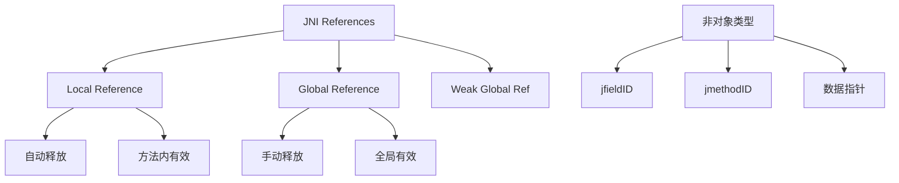
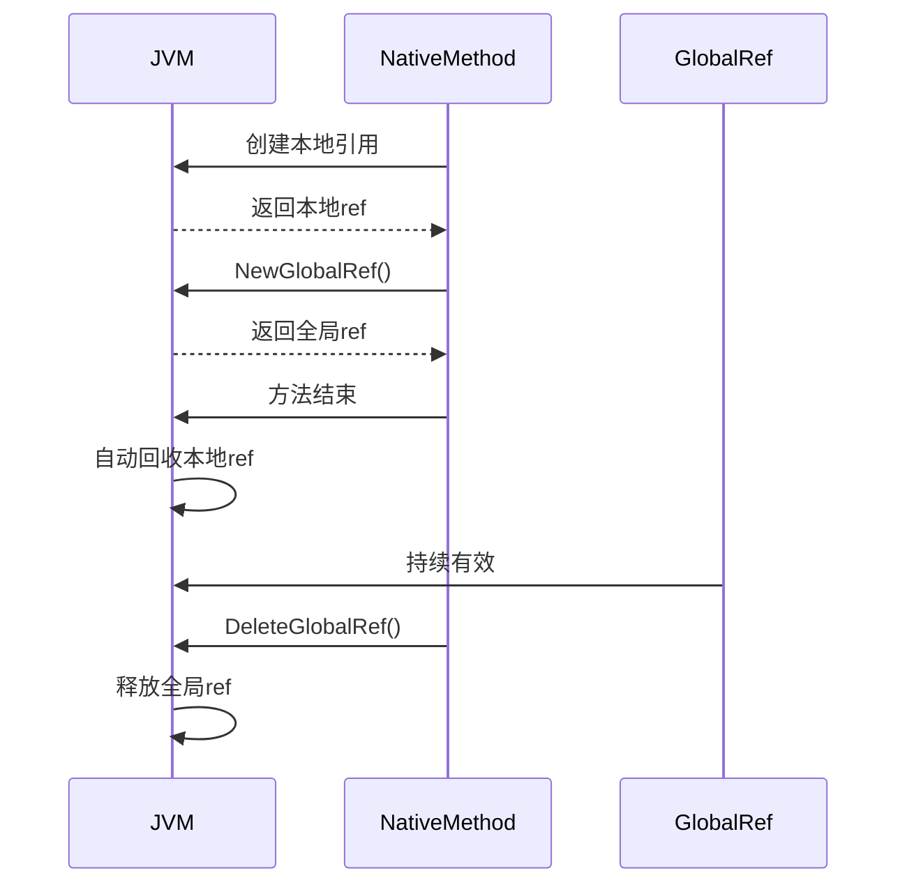
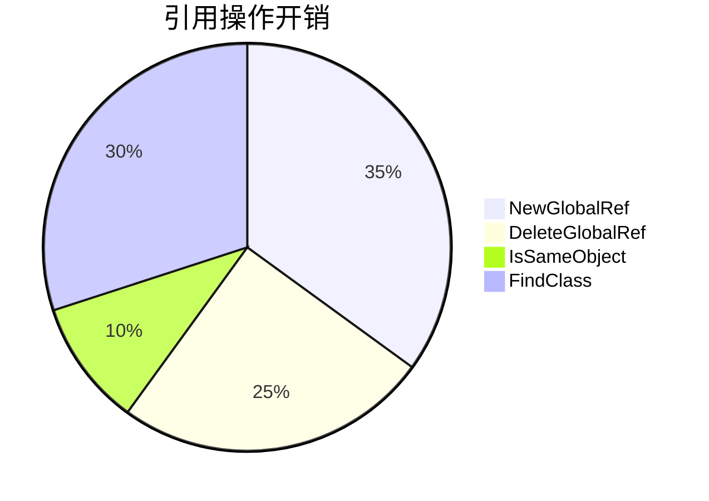

好的，我将分步骤为您详细解析JNI中的引用机制，并通过多个维度展开讲解：

# 一、核心概念图解


# 二、本地引用详解
## 1. 本质特性
- **生命周期：** 与当前线程的JNI方法调用周期绑定
- **内存管理：** 由JVM自动回收（但需注意显式释放场景）
- **作用域：** 仅在当前native方法执行期间有效

## 2. 典型场景
```cpp
JNIEXPORT void JNICALL Java_MyClass_nativeMethod(JNIEnv* env, jobject obj) {
    jclass localClass = env->FindClass("java/lang/String"); // 创建本地引用
    // 使用localClass...
    // 方法结束时自动释放
}
```

## 3. 内存管理细节
- **默认容量池：** 16个槽位（不同JVM实现可能不同）
- **扩容机制：
```cpp
// 方式1：手动删除
for (int i = 0; i < 100; i++) {
    jobject localRef = env->GetObjectArrayElement(array, i);
    // 使用后立即释放
    env->DeleteLocalRef(localRef);
}

// 方式2：提前预留
env->EnsureLocalCapacity(100); // 显式申请容量
// 或使用栈帧
env->PushLocalFrame(100);      // 创建新作用域
// ...创建多个本地引用
env->PopLocalFrame(nullptr);   // 批量释放
```

# 三、全局引用深度解析
## 1. 创建与销毁
```cpp
// 创建过程
jclass localClass = env->FindClass("com/example/MyClass");
jclass globalClass = static_cast<jclass>(env->NewGlobalRef(localClass));
env->DeleteLocalRef(localClass); // 及时清理本地引用

// 销毁时机
env->DeleteGlobalRef(globalClass);
```

## 2. 生命周期对比


## 3. 典型应用场景
- **类元信息缓存：**
```cpp
// 全局类引用初始化
static jclass gMyClass;
JNIEXPORT void JNICALL JNI_OnLoad(JavaVM* vm, void* reserved) {
    JNIEnv* env;
    vm->GetEnv((void**)&env, JNI_VERSION_1_6);
    jclass localClass = env->FindClass("com/example/MyClass");
    gMyClass = static_cast<jclass>(env->NewGlobalRef(localClass));
    env->DeleteLocalRef(localClass);
}

// 使用示例
JNIEXPORT void JNICALL Java_MyClass_method(JNIEnv* env, jobject obj) {
    jmethodID method = env->GetMethodID(gMyClass, "callback", "()V");
    // 使用method...
}
```

# 四、关键注意事项
## 1. 引用比较原则
```cpp
jobject ref1 = env->NewGlobalRef(obj);
jobject ref2 = env->NewGlobalRef(obj);

// 错误方式：直接指针比较
if (ref1 == ref2) { /* 不可靠！ */ }

// 正确方式：使用JNI API
if (env->IsSameObject(ref1, ref2)) {
    // 逻辑处理
	// 处理引用是否被处理了
}
```

## 2. 跨线程行为
跨线程附加的线程（AttachCurrtentThread）操作不会主动释放本地引用
```cpp
void* thread_func(void* arg) {
    JavaVM* vm = (JavaVM*)arg;
    JNIEnv* env;
    vm->AttachCurrentThread(&env, nullptr);

    // 创建的本地引用不会自动释放！
    jclass localClass = env->FindClass("java/lang/Thread");
    // 必须显式释放
    env->DeleteLocalRef(localClass);

    vm->DetachCurrentThread();
    return nullptr;
}
```

## 3. 特殊类型处理(字符串必须被处理)
```cpp
// 正确处理字符串
const char* str = env->GetStringUTFChars(jstr, nullptr);
// 使用字符串...
env->ReleaseStringUTFChars(jstr, str); // 必须释放

// 正确使用数组
jintArray array = env->NewIntArray(10);
jint* elements = env->GetIntArrayElements(array, nullptr);
// 修改数组...
env->ReleaseIntArrayElements(array, elements, 0); // 同步回Java层
```

# 五、内存管理最佳实践
1. **本地引用：**
- 循环内创建大量引用时，使用`DeleteLocalRef`及时清理
- 优先使用`PushLocalFrame`/`PopLocalFrame`管理作用域

2. **全局引用：**
- 使用后立即记录在全局结构体中
- 配套实现`finalize`方法确保释放
- 避免长期持有不必要的大对象

1. **跨线程规范：**


# 六、原理深度解析
## 1. 设计哲学
- **安全隔离：** 本地引用机制防止native代码意外持有Java对象导致内存泄漏
- **生命周期解耦：** 全局引用允许native代码与Java对象生命周期解绑
- **跨语言桥梁：** 通过引用机制实现Java堆与native内存的安全交互

## 2. 实现机制
- **本地引用表：** 每个线程维护一个引用表，索引值对应实际对象
- **全局引用表：** 全局共享的引用表，独立于线程存在
- **垃圾回收协作：** 全局引用会阻止对象被GC回收，本地引用不会

## 3. 性能考量


通过这样的分层讲解，您应该能够全面理解JNI引用机制的设计意图、实现原理和实际应用要点。核心要记住：正确管理引用生命周期是编写稳定JNI代码的关键。


