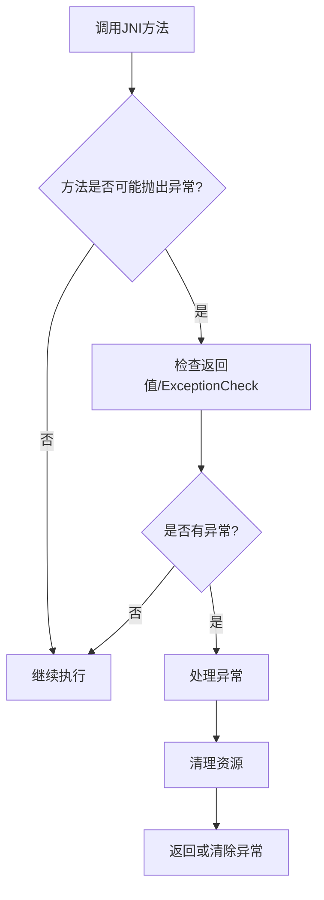
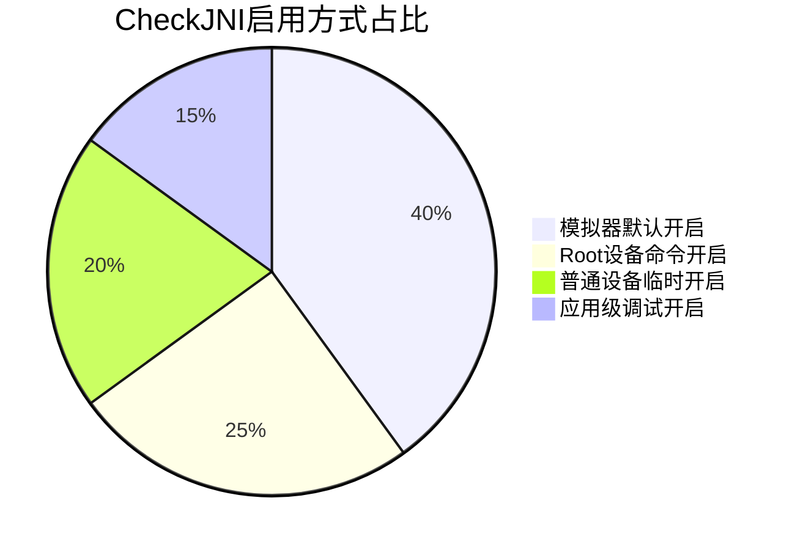
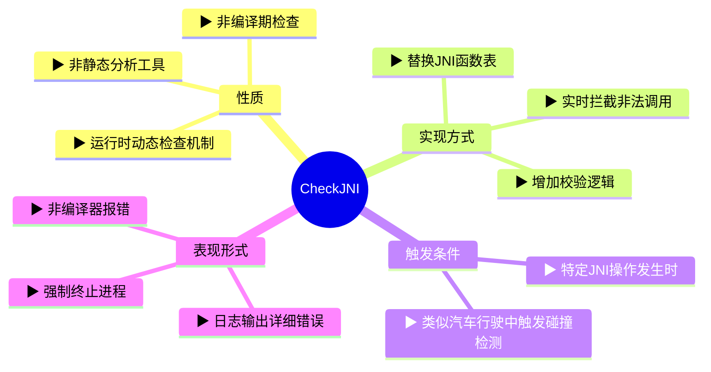
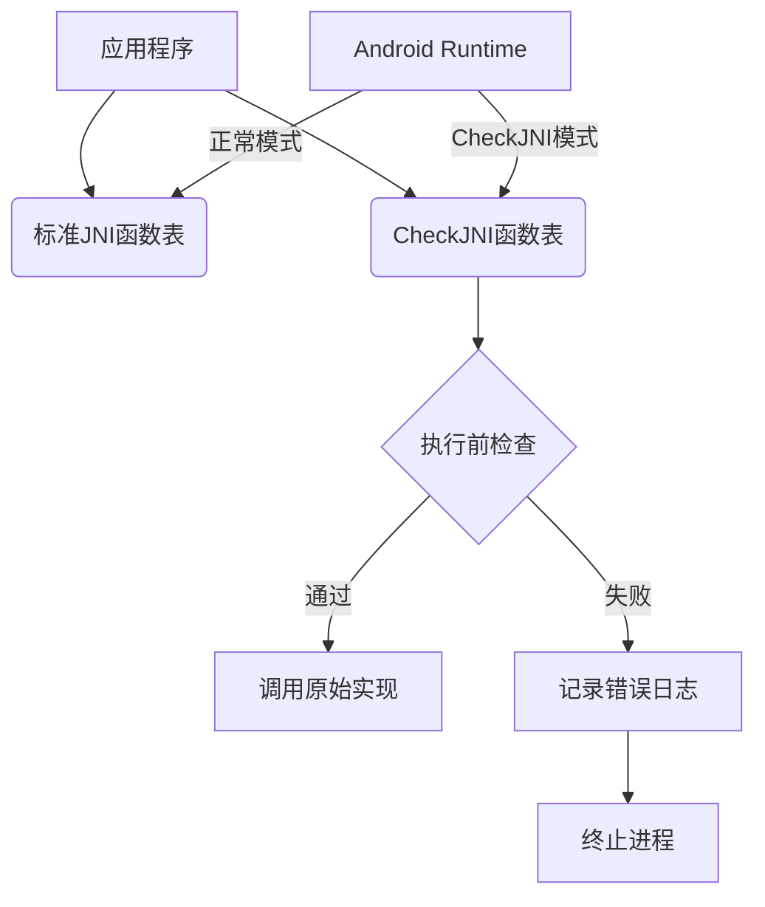
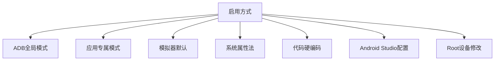

# JNI的异常处理与安全检查

## 一、本质原理层（用人类思维理解核心机制）
-------------------
这篇文章的核心是讲解JNI开发中的两个关键点：异常处理机制和安全检查模式。我们可以用"交通管制"来类比理解：

1. **异常处理就像交通事故处理**：
- 当Java层发生异常（交通事故）时，原生代码（其他车辆）必须立即靠边停车（停止常规操作）
- **只有交警（特定的JNI清理函数）可以继续行动处理现场**
- 事故未处理前，其他车辆（常规JNI调用）必须等待

2. **CheckJNI模式相当于智能监控系统**：
- 普通模式下道路没有监控（基础检查）
- CheckJNI模式开启后，遍布摄像头和传感器（扩展检查）
- 实时检测违规行为：超速（错误指针）、逆行（类型错误）、无证驾驶（错误引用）等

## 二、技术实现层（逐层展开关键知识点）
---------------------
### 1. 异常处理机制
#### 关键规则表
| 允许调用的JNI函数          | 禁止调用的函数示例       | 典型场景                      |
|---------------------------|--------------------------|-----------------------------|
| DeleteGlobalRef           | GetFieldID              | 清理引用时发现异常           |
| ExceptionCheck            | CallVoidMethod          | 方法调用后检查异常           |
| ReleasePrimitiveArrayCritical | NewObjectArray        | 释放资源时处理异常           |

#### 代码示例解析
```c
jstring javaStr = (*env)->NewStringUTF(env, "Hello");
if (javaStr == NULL) {
    // 这里不需要显式检查异常，因为NewStringUTF在失败时会返回NULL并设置异常
    return;
}

jmethodID mid = (*env)->GetMethodID(env, cls, "dangerousMethod", "()V");
(*env)->CallVoidMethod(env, obj, mid);
if ((*env)->ExceptionCheck(env)) { // 必须显式检查
    (*env)->ExceptionDescribe(env); // 打印异常信息
    (*env)->ExceptionClear(env);    // 清理异常
    return;
}
```

#### 异常处理流程图


### 2. CheckJNI模式
#### 检查类型对照表
| 检查类别          | 典型错误示例                      | 后果               | 检查方式                     |
|-------------------|-----------------------------------|--------------------|----------------------------|
| 数组操作          | jintArray array = NewIntArray(-5) | 内存破坏           | 数组大小非负校验            |
| 类型安全          | 将jstring赋值给int字段           | 数据错乱           | 类型匹配校验                |
| 临界区调用        | 在GetPrimitiveArrayCritical后调用其他JNI函数 | 死锁风险           | 调用链监控                  |
| 线程安全          | 跨线程使用JNIEnv*                | 未定义行为         | 线程绑定检查                |
| 引用管理          | DeleteGlobalRef误删局部引用       | 内存泄漏/崩溃      | 引用类型校验                |

#### CheckJNI启用方式对比


## 三、实践应用层（开发中的正确姿势）（可抄必会）
---------------------
### 异常处理最佳实践
1. **防御性编程模板**：
```c
// 1. 方法入口检查
if ((*env)->ExceptionCheck(env)) {
    (*env)->ExceptionClear(env);
    // 记录日志或处理异常
}

// 2. 执行可能抛出异常的操作
jobject result = (*env)->CallObjectMethod(env, obj, mid);

// 3. 立即检查异常
if ((*env)->ExceptionCheck(env)) {
    // 4. 异常处理三部曲
    (*env)->ExceptionDescribe(env);  // 打印堆栈
    jthrowable ex = (*env)->ExceptionOccurred(env);
    handle_exception(env, ex);       // 自定义处理
    (*env)->ExceptionClear(env);     // 必须清理
    return safe_default_value;       // 返回安全值
}
```

2. **异常信息提取示例**：
```c
void handle_exception(JNIEnv* env, jthrowable exception) {
    jclass exClass = (*env)->GetObjectClass(env, exception);
    jmethodID getMessage = (*env)->GetMethodID(env, exClass, 
        "getMessage", "()Ljava/lang/String;");
    jstring message = (*env)->CallObjectMethod(env, exception, getMessage);
    
    if (message != NULL) {
        const char* msgChars = (*env)->GetStringUTFChars(env, message, NULL);
        LOG_ERROR("Exception: %s", msgChars);
        (*env)->ReleaseStringUTFChars(env, message, msgChars);
    }
}
```

### CheckJNI调试技巧
1. **典型错误案例**：
```c
// 错误1：跨线程使用JNIEnv
void* thread_func(void* arg) {
    JNIEnv* env = (JNIEnv*)arg;
    // 错误：每个线程必须通过AttachCurrentThread获取自己的env
    jclass wrongClass = (*env)->FindClass(env, "java/lang/String"); 
}

// 错误2：错误释放引用
jobject globalRef = (*env)->NewGlobalRef(env, localObj);
// ...
(*env)->DeleteLocalRef(env, globalRef); // 应该使用DeleteGlobalRef
```

2. **CheckJNI错误日志分析**：
```
JNI ERROR (app bug): accessed stale LocalRef 0x7902
JNI ERROR (app bug): expected element type int[] but got byte[]
JNI WARNING: 0xdeadd00d is a invalid JNI reference
```

1. **内存管理检查表**：
```
□ 1. 每个GetXXX是否对应ReleaseXXX？
□ 2. 全局引用是否在合适时机释放？
□ 3. 临界区操作是否保持最短时间？
□ 4. 跨线程调用是否使用正确JNIEnv？
□ 5. 异常发生后是否清理资源？
```

总结：理解JNI异常处理的关键在于记住"异常状态下的有限操作原则"，而CheckJNI则是开发者的安全网。就像外科医生需要严格遵守无菌操作规范一样，JNI开发者必须建立严格的代码纪律，才能避免那些难以调试的native崩溃问题。


# ExceptionClear(env)是怎么工作的


`(*env)->ExceptionClear(env)` 的底层操作原理和具体作用可以用一个生动的比喻来理解：

**就像医院急诊室的报警灯系统**：

1. **异常产生时**：
   - 当Java层抛出异常 → 相当于病房按下了紧急呼叫按钮
   - JVM会在当前线程设置异常标志 → 急诊室的红色警报灯亮起
   - 所有常规JNI操作被禁止 → 医护人员暂停常规工作

2. **ExceptionClear的作用**：
   ```mermaid
   sequenceDiagram
       participant Native Code
       participant JVM
       Native Code->>JVM: ExceptionClear()
       JVM->>JVM: 清除异常标志位
       JVM->>JVM: 释放异常对象引用计数
       JVM-->>Native Code: 返回void
   ```

3. **具体操作细节**：
   - 清除线程的异常状态位（相当于关闭警报灯）
   - 递减异常对象的引用计数（但不保证立即回收）
   - 允许后续JNI调用正常执行（恢复常规医疗工作）

4. **关键注意事项**：
   - **不会终止异常传播**：如果从Java调用的native方法返回时仍有异常，Java层依然会收到异常
   - **内存不会立即释放**：已获取的jthrowable对象依然有效，直到手动释放引用
   - **状态重置**：之后调用ExceptionCheck()将返回JNI_FALSE

**开发中的典型场景**：
```c
jthrowable ex = (*env)->ExceptionOccurred(env);
if (ex) {
    // 相当于查看急诊室监控录像
    print_exception_details(env, ex);
    
    // 相当于关闭警报灯但保留病历记录
    (*env)->ExceptionClear(env);
    
    // 此时可以安全调用其他JNI函数
    create_error_report(env, ex);
    
    // 必须手动释放异常引用
    (*env)->DeleteLocalRef(env, ex);
}
```

**危险操作示例**：
```c
(*env)->CallVoidMethod(env, obj, mid);
if ((*env)->ExceptionCheck(env)) {
    // 错误！未清除异常就调用常规JNI函数
    jclass newCls = (*env)->GetObjectClass(env, obj); // 可能崩溃！
    
    // 正确做法应先清除异常
    (*env)->ExceptionClear(env);
    // 然后才能调用其他JNI函数
}
```

**与Java层的对比**：

| 操作                | Java层                  | JNI层                          |
|---------------------|-------------------------|--------------------------------|
| 异常检测            | try-catch               | ExceptionCheck/ExceptionOccurred |
| 异常清除            | catch块自动处理         | 必须显式调用ExceptionClear     |
| 异常传播            | 自动向上抛出            | 需手动返回或抛出新异常         |
| 异常信息获取        | e.getMessage()          | 反射调用getMessage()           |

**底层原理深入**：
1. JVM为每个线程维护一个异常指针
2. ExceptionClear的伪代码实现：
   ```cpp
   void JNIEnv::ExceptionClear() {
       Thread* thread = GetCurrentThread();
       thread->SetException(nullptr);  // 清除指针
       thread->exception_ref.DecrementRefCount();  // 减少引用
   }
   ```
3. 清除后内存状态变化：
   ```mermaid
   graph LR
     A[异常对象] --> B[线程异常指针]
     B -->|ExceptionClear| C[NULL]
     A --> D[全局引用表]
     D -->|引用计数减1| E{计数为0?}
     E -->|是| F[GC回收]
     E -->|否| G[继续存在]
   ```

**最佳实践建议**：
4. 在以下情况必须清除异常：
   - 需要继续执行后续JNI代码时
   - 处理完异常后需要创建新的JNI对象时
5. 在以下情况不要清除异常：
   - 准备立即返回Java层传播异常时
   - 在native方法退出前（让Java层捕获异常）
6. 配套操作建议：
   ```c
   // 推荐的安全处理模板
   void safe_call(JNIEnv* env) {
       if ((*env)->ExceptionCheck(env)) {
           jthrowable ex = (*env)->ExceptionOccurred(env);
           (*env)->ExceptionClear(env);
           // 处理异常...
           (*env)->DeleteLocalRef(env, ex);
       }
       // 继续安全操作...
   }
   ```

**性能影响**：
- 轻量级操作：只是清除标志位和修改引用计数
- 但频繁的异常抛出/清除会影响性能（类似Java层的异常滥用）
- 建议在错误处理路径使用，正常流程应避免依赖异常机制

通过这样的深度解析，可以理解ExceptionClear不是简单地"删除异常"，而是重置线程状态的关键操作，**既要保证后续JNI调用的安全性**，又要妥善管理异常对象的生命周期。
> 明确异常是什么，然后清理异常状态再调用别的JNI函数处理


# CheckJNI的补充


您对CheckJNI的困惑非常合理，让我们用"汽车安全检测系统"的比喻来彻底理清这个概念：

**CheckJNI的本质是：Android运行时（Runtime）的增强型安全防护罩**

### 一、概念拆解（三维度解析）


### 二、技术实现原理
#### 1. 底层架构图


#### 2. 典型工作流程（以错误类型检查为例）
```c
// 开发者代码
jintArray array = (*env)->NewIntArray(env, -5);  // 错误：数组大小为负数

// CheckJNI介入流程
1. 拦截NewIntArray调用
2. 检查size参数是否为负数
3. 发现size=-5 < 0
4. 输出日志："JNI ERROR (app bug): negative array size (-5)"
5. 主动abort进程
```

#### 3. 与编译器的本质区别
| 特性              | 编译器检查                     | CheckJNI检查                  |
|-------------------|------------------------------|-------------------------------|
| 检查时机          | 代码编译期间                  | 程序运行期间                  |
| 检查依据          | 语法规则/类型系统             | JNI规范/内存安全              |
| 错误表现          | 编译失败                      | 运行时崩溃+日志               |
| 作用范围          | 所有Java代码                  | 仅JNI调用边界                 |
| 典型错误类型      | 语法错误/类型不匹配           | 非法指针/错误引用类型         |

### 三、实际开发中的具象化表现
#### 案例1：错误使用jfieldID
```c
// 错误代码示例
jclass cls = (*env)->GetObjectClass(env, obj);
jfieldID fid = (*env)->GetFieldID(env, cls, "name", "Ljava/lang/String;");

// 错误操作：将int赋值给String字段
(*env)->SetIntField(env, obj, fid, 100);  // 类型不匹配

// CheckJNI检测过程：
6. 记录调用栈信息
7. 检查字段类型是否为int
8. 发现字段实际类型是Ljava/lang/String;
9. 输出错误日志：
   "JNI ERROR (app bug): expected type int but set field with type java.lang.String"
10. 主动触发abort()
```

#### 案例2：跨线程JNIEnv误用
```mermaid
sequenceDiagram
    participant Thread1
    participant CheckJNI
    participant Thread2

    Thread1->>CheckJNI: 创建JNIEnv*
    CheckJNI-->>Thread1: 返回env1

    Thread2->>CheckJNI: 尝试使用env1
    CheckJNI->>CheckJNI: 检查线程绑定关系
    CheckJNI-->>Thread2: 记录错误：
    "JNI ERROR (app bug): thread is using JNIEnv* from Thread1"
    CheckJNI->>CheckJNI: 终止进程
```

### 四、开发中的直观体验
**启用CheckJNI后的logcat输出示例**：
```log
E JNI CHECK: JNI call to DeleteGlobalRef with pending exception 'java.lang.NullPointerException'
E JNI CHECK:     in call to DeleteGlobalRef
E JNI CHECK:     from void com.example.NativeHelper.destroy()
E JNI CHECK: "main" prio=5 tid=1 Runnable
E JNI CHECK:   | group="main" sCount=0 dsCount=0 flags=0 obj=0x12c00000 self=0xb4d0000
E JNI CHECK:   at com.example.NativeHelper.destroy(Native Method)
E JNI CHECK: Pending exception is:
E JNI CHECK: java.lang.NullPointerException: Attempt to invoke virtual method...
```

**关键特征**：
11. 明确标注"JNI CHECK"
12. 指出违反的具体规则
13. 显示完整的调用堆栈
14. 包含线程状态信息
15. 附带相关异常详情

### 五、与常规模式的核心差异对照表
| 检查维度         | 普通模式                     | CheckJNI模式                  |
|------------------|-----------------------------|-------------------------------|
| 性能             | 全速运行                    | 有约10-15%的性能损耗          |
| 错误反馈         | 直接崩溃/无提示             | 详细错误日志+明确终止         |
| 内存安全检查     | 仅基础检查                  | 扩展内存屏障检查              |
| 类型转换验证     | 不验证                      | 严格类型匹配                  |
| 临界区保护       | 无                          | 监控Get/Release配对           |
| 开发阶段建议     | 禁止                        | 必须启用                      |
| 生产环境         | 默认关闭                    | 必须关闭                      |

### 六、技术本质总结
CheckJNI是Android系统实现的**运行时JNI调用验证器**，其核心原理是：

16. **函数表劫持**：替换原始的JNI函数指针表
17. **调用前校验**：在每个JNI调用执行前插入检查逻辑
18. **安全隔离**：发现违规立即终止，防止内存污染扩散
19. **诊断增强**：提供比原生崩溃更详细的调试信息

相当于在JNI边界处设置了智能安检门，所有通过这个边界的操作都要经过严格扫描，确保不会携带危险品（非法指针、错误类型等）进入Java世界。


# CheckJNI的启用


CheckJNI的启用和禁用更像是在**给Android系统安装一个实时安检系统**，以下是详细的配置指南（包含7种启用方式和3种验证方法）：

---

### 一、启用CheckJNI的七大方式


#### 1. ADB全局启用（适用于真机调试）
```bash
# 相当于打开全系统的JNI安检门
adb shell setprop debug.checkjni 1

# 效果：
# - 对所有已安装应用生效
# - 需要重启APP（杀死进程后重新启动）
# - Android 4.2+ 支持
```

#### 2. 应用专属启用（推荐方式）
```bash
# 给特定APP安装专用安检器
adb shell setprop dalvik.vm.checkjni com.example.myapp

# 特点：
# - 只影响指定包名的APP
# - 无需重启整个系统
# - 适合多APP同时调试
```

#### 3. 模拟器自动模式
```bash
# 官方模拟器默认配置：
# - API Level < 19: 自动启用
# - API Level >=19: 需手动启用

# 检查模拟器状态：
adb logcat | grep 'CheckJNI'
```

#### 4. 系统属性文件修改（需root）
```bash
# 永久生效方式（重启后依然有效）
su
echo -n "1" > /data/local.prop
chmod 644 /data/local.prop
reboot
```

#### 5. 代码硬编码启用（仅限调试）
```java
// 在Application的onCreate中添加
public class MyApp extends Application {
    @Override
    public void onCreate() {
        if (BuildConfig.DEBUG) {
            // Android 8.0+ 有效
            android.os.SystemProperties.set("debug.checkjni", "1");
        }
    }
}
```

#### 6. Android Studio快捷配置
```xml
<!-- 修改Run/Debug Configuration的VM options -->
-Xcheck:jni

// 实际效果相当于：
// 在启动Activity时添加JVM参数
```

#### 7. 动态启用（API Level 26+）
```java
// 在Native代码加载前调用
if (android.os.Build.VERSION.SDK_INT >= 26) {
    VMRuntime.getRuntime().setCheckJniEnabled(true);
}
```

---

### 二、禁用CheckJNI的三种场景
#### 1. 生产环境强制关闭
```bash
# 确保release版本关闭安检
adb shell setprop debug.checkjni 0
adb shell setprop dalvik.vm.checkjni ""

# 必须操作：
# - 清理构建缓存
# - 卸载旧版本APP
# - 重新安装发布版APK
```

#### 2. 性能敏感场景
```java
// 在代码中动态关闭（高风险操作）
if (isCheckJniEnabled()) {
    VMRuntime.getRuntime().setCheckJniEnabled(false);
}
```

#### 3. 兼容性处理
```bash
# 遇到老旧设备崩溃时临时禁用
adb shell settings put global checkjni 0
adb reboot
```

---

### 三、验证CheckJNI状态的三种方法
#### 1. 日志特征检测
```bash
adb logcat | grep -E "CheckJNI|JNI WARNING"

# 启用成功标志：
# D Late-enabling CheckJNI
# I CheckJNI enabled
```

#### 2. 运行时API检测
```java
// 在Java层检测
boolean isEnabled = VMRuntime.getRuntime().isCheckJniEnabled();
Log.d("JNI_STATUS", "CheckJNI: " + isEnabled);
```

#### 3. Native层验证
```c
// 故意触发错误操作验证
JNIEnv* env = ...;
jclass wrongClass = (*env)->FindClass(env, "java/lang/NotExistClass");
if ((*env)->ExceptionCheck(env)) {
    // 如果看到详细错误日志说明CheckJNI生效
}
```

---

### 四、各Android版本的差异处理
| API Level | 启用方式变化                     | 注意事项                     |
|-----------|--------------------------------|----------------------------|
| < 16      | 仅支持adb全局模式               | 需要完全重启设备            |
| 16-25     | 支持应用级属性设置              | 需adb修改属性               |
| 26+       | 支持运行时动态启用              | 需在加载native库前调用      |
| 29+       | 强化安全检查                    | 部分错误会直接导致ANR       |
| 31+       | 默认开启部分检查项              | 即使关闭也有基础校验        |

---

### 五、开发环境配置示例（Android Studio）
1. **修改运行配置**：
   ```xml
   <!-- app/build.gradle -->
   android {
       defaultConfig {
           ndk {
               // 强制启用JNI检查
               cFlags "-Xcheck:jni"
           }
       }
   }
   ```

2. **模板化配置**：
   ```bash
   # 在gradle.properties中添加：
   android.debug.jni.enableCheckJni=true
   ```

3. **快速切换脚本**：
   ```bash
   # checkjni.sh
   if [ "$1" == "enable" ]; then
       adb shell setprop debug.checkjni 1
       adb shell setprop dalvik.vm.checkjni true
   else
       adb shell setprop debug.checkjni 0
       adb shell setprop dalvik.vm.checkjni false
   fi
   adb shell am force-stop com.example.myapp
   ```

---

### 六、常见问题排查
**问题现象**：启用CheckJNI后APP立即崩溃  
**诊断步骤**：
4. 查看logcat中首个CheckJNI错误
5. 检查是否误用JNIEnv跨线程
6. 验证jfieldID/jmethodID是否正确缓存
7. 确认没有直接访问Java对象的原始指针

**典型错误修复**：
```c
// 错误代码：
jstring str = (*env)->NewStringUTF(env, "hello");
(*env)->DeleteLocalRef(env, str);
// 再次使用str → CheckJNI报错

// 修复方案：
jstring str = (*env)->NewStringUTF(env, "hello");
// 使用str...
(*env)->DeleteLocalRef(env, str);
str = NULL; // 明确置空
```

---

通过这种多维度配置方式，开发者可以根据不同场景灵活控制CheckJNI的启用状态，既能获得严格的安全检查，又能在性能敏感场景下保持高效运行。