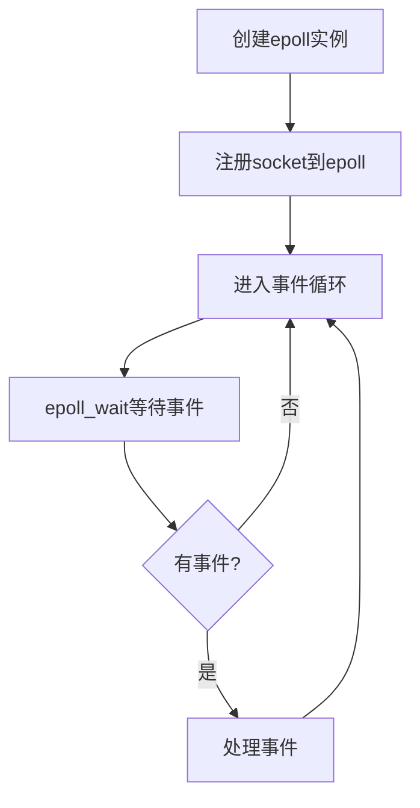

前言：
epoll必备三件套：
- `int epoll_fd = epoll_create1(0)`——创建一个epoll的文件描述符，后面两个函数的第一个参数就是它

- `epoll_ctl`，它的函数原型为
```c++
int epoll_ctl(int epoll_fd, int operation, int sock_fd, struct epoll_event *event)
```
其中两个fd分别对应epoll的文件描述符以及需要被注册的sock的描述符。
`operation`是一个枚举，为：  
- `EPOLL_CTL_ADD`：注册新的 fd 到 epoll
- `EPOLL_CTL_MOD`：修改已注册的 fd 监听事件
- `EPOLL_CTL_DEL`：从 epoll 删除 fd
`event`为要给`sock_fd`注册的事件的指针。

弄好ctl后，epoll会在内部自行维护一个这样的数组，然后我们可以通过`epoll_wait`来获取发生事件的数组
- `epoll_wait`的函数原型：
```cpp
int epoll_wait(int epoll_fd, struct epoll_event *events,
               int maxevents, int timeout);
```
- `epoll_fd`：epoll 实例描述符
- `events`：**输出参数，用于接收就绪事件的数组**, 输入参数作为输出结果，不意外吧
- `maxevents`：数组容量（必须 > 0）
- `timeout`： 设置超时情况
  - `-1`：阻塞等待直到有事件
  - `0`：立即返回（非阻塞）
  - `>0`：等待超时时间（毫秒）


# 大概介绍


在C++网络编程中，`epoll`是Linux系统下高性能I/O多路复用机制的核心技术，尤其适合处理高并发网络连接。以下是从底层原理到实际应用的详细解析：

---

### 一、核心原理
3. **与select/poll的对比**
   - 传统select：O(n)轮询所有fd，存在1024文件描述符限制
   - poll：改进为链表存储，取消数量限制但仍是线性扫描
   - epoll：采用事件驱动机制，仅关注活跃fd，时间复杂度O(1)

4. **数据结构**
   - 红黑树：用于高效管理海量文件描述符（插入/删除O(logN)）
   - 就绪链表：内核维护的就绪事件列表
   - 内存映射：用户空间和内核空间共享内存区域（`epoll_event`数组）

5. **触发模式差异**
   ```cpp
   // 边沿触发模式（ET）
   event.events = EPOLLIN | EPOLLET;
 
   // 水平触发模式（LT）- 默认
   event.events = EPOLLIN;
   ```
   - LT：数据未处理时会持续通知（类似select行为）
   - ET：仅在状态变化时触发，需配合非阻塞I/O彻底读取数据

**注意看这里事件的名称，比原来的`poll`多了E字**

---

### 二、关键API详解
6. **epoll_create**
   ```cpp
   int epoll_fd = epoll_create1(0);  // 优于旧版epoll_create
   ```
   - 创建epoll实例，返回文件描述符
   - 参数size在Linux 2.6.8后已无意义

7. **epoll_ctl**
   ```cpp
   struct epoll_event event;
   event.data.fd = sockfd;
   event.events = EPOLLIN | EPOLLET;
 
   epoll_ctl(epoll_fd, EPOLL_CTL_ADD, sockfd, &event);
   ```
   - 操作类型：
     - EPOLL_CTL_ADD：注册新fd
     - EPOLL_CTL_MOD：修改监听事件
     - EPOLL_CTL_DEL：移除监听

8. **epoll_wait**
   ```cpp
   const int MAX_EVENTS = 64;
   struct epoll_event events[MAX_EVENTS];
 
   int n = epoll_wait(epoll_fd, events, MAX_EVENTS, -1); // 阻塞等待
   ```
   - 返回就绪事件数量
   - timeout参数：
     - -1：无限等待
     - 0：立即返回
     - >0：超时时间(ms)

---

### 三、高性能实现要点
9. **非阻塞I/O必须性（ET模式）**
   ```cpp
   // 设置socket非阻塞
   int flags = fcntl(sockfd, F_GETFL, 0);
   fcntl(sockfd, F_SETFL, flags | O_NONBLOCK);
   ```

10. **ET模式下的完整读取**
   ```cpp
   while(true) {
       ssize_t count = read(fd, buf, sizeof(buf));
       if (count == -1) {
           if (errno == EAGAIN || errno == EWOULDBLOCK) 
               break;  // 数据读取完毕
           // 处理真实错误
           break;
       }
       if (count == 0) { // 连接关闭
           close(fd);
           break;
       }
       // 处理数据
   }
   ```

11. **连接管理优化**
   - 使用`epoll_data`联合体携带上下文信息：
   ```cpp
   struct epoll_event event;
   event.data.ptr = (void*)&connection; // 指向自定义连接对象
   ```

---

### 四、完整示例代码
```cpp
#include <sys/epoll.h>
#include <fcntl.h>
#include <unistd.h>
#include <vector>

#define MAX_EVENTS 1024

int main() {
    int listen_sock = setup_listening_socket(8080); // 创建监听socket
  
    int epoll_fd = epoll_create1(0);
    struct epoll_event event;
    event.events = EPOLLIN | EPOLLET;
    event.data.fd = listen_sock;
    epoll_ctl(epoll_fd, EPOLL_CTL_ADD, listen_sock, &event);

    std::vector<epoll_event> events(MAX_EVENTS);
  
    while(true) {
        int n = epoll_wait(epoll_fd, events.data(), events.size(), -1);
      
        for(int i = 0; i < n; ++i) {
            if(events[i].data.fd == listen_sock) {
                // 处理新连接
                while(true) {
                    sockaddr_in client_addr;
                    socklen_t addr_len = sizeof(client_addr);
                    int conn_fd = accept4(listen_sock, 
                                        (sockaddr*)&client_addr,
                                        &addr_len,
                                        SOCK_NONBLOCK); // 直接设置非阻塞
                  
                    if(conn_fd == -1) {
                        if(errno == EAGAIN || errno == EWOULDBLOCK)
                            break; // 已接受所有连接
                        // 处理错误
                        break;
                    }
                  
                    struct epoll_event ev;
                    ev.events = EPOLLIN | EPOLLET;
                    ev.data.fd = conn_fd;
                    epoll_ctl(epoll_fd, EPOLL_CTL_ADD, conn_fd, &ev);
                }
            } else {
                // 处理已连接套接字
                handle_client(events[i].data.fd);
            }
        }
    }
    close(epoll_fd);
    return 0;
}
```

---

### 五、性能调优建议
12. **事件批量处理**
   - 单次`epoll_wait`返回多个事件，使用vector预分配空间
   - 建议事件数组大小设置为预估最大并发连接数的1/4

13. **线程模型选择**
   - 单线程ET模式：适用于计算密集型
   - Reactor模式：单线程事件分发+线程池处理
   - SO_REUSEPORT+多epoll实例：用于多核扩展

14. **内核参数调优**
   ```bash
   # 修改系统最大文件描述符数
   echo 1024000 > /proc/sys/fs/file-max
 
   # 调整epoll就绪列表大小
   sysctl -w net.core.somaxconn=32768
   ```

---

### 六、常见问题排查
15. **EPOLLERR处理**
   - 总是检查错误标志：
   ```cpp
   if (events[i].events & EPOLLERR) {
       int error = 0;
       socklen_t errlen = sizeof(error);
       getsockopt(fd, SOL_SOCKET, SO_ERROR, &error, &errlen);
       // 记录错误日志
   }
   ```

16. **惊群问题**
   - Linux 4.5+可使用`EPOLLEXCLUSIVE`标志
   - 旧内核建议使用REUSEPORT进行负载均衡

17. **内存管理**
   - 使用智能指针管理连接对象
   - 注意跨线程访问的数据竞争问题

---

`epoll`机制是构建高性能网络服务的基石，但实际使用时需要结合具体场景进行优化。对于需要处理10万+并发连接的情况，建议结合内存池、零拷贝等技术进行深度优化。在Windows平台开发时，可考虑使用WSL2或转向IOCP模型。


# 进一步学习


好的！我将结合 `fcntl` 和 `epoll` 的三个核心 API（`epoll_create`, `epoll_ctl`, `epoll_wait`），从函数参数、返回值到机制作用进行详细解析。

---

### 一、`fcntl` 函数详解
#### 1. 功能作用
`fcntl`（File Control）是用于操作文件描述符的系统调用，在网络编程中主要用于：
- **设置非阻塞模式**（必须与 `epoll` ET 模式配合）
- 获取/设置文件描述符状态标志
- 文件锁控制（网络编程中较少使用）

#### 2. 关键参数
```cpp
#include <fcntl.h>

int fcntl(int fd, int cmd, ... /* arg */ );
```
- **fd**：要操作的文件描述符（socket）
- **cmd**：
  - `F_GETFL`：获取文件状态标志
  - `F_SETFL`：设置文件状态标志
- **arg**：标志位组合（如 `O_NONBLOCK`）

#### 3. 设置非阻塞模式
```cpp
// 获取当前标志
int flags = fcntl(sockfd, F_GETFL, 0);  // 这里是获取文件标志 F_GETFL

// 添加非阻塞标志
fcntl(sockfd, F_SETFL, flags | O_NONBLOCK); // 这里是设置文件标志F_SETFL
```


#### 4. 与 `epoll` 的关系
- **ET 模式必须配合非阻塞 I/O**：避免 `read`/`write` 在未完成时阻塞线程
- **边缘触发要求一次性处理完数据**：通过循环读取直到返回 `EAGAIN`/`EWOULDBLOCK`

---

### 二、`epoll` 核心 API 深度解析

#### 1. `epoll_create` / `epoll_create1`
```cpp
#include <sys/epoll.h>

int epoll_create(int size);          // 传统方式
int epoll_create1(int flags);        // 推荐使用（Linux 2.6.27+）
```

**参数解析**：
- `size`（已废弃）：早期内核用此值预估监控的fd数量，现代内核自动调整
- `flags`：
  - `0`：传统行为
  - `EPOLL_CLOEXEC`：设置 close-on-exec 标志（避免子进程继承）

**返回值**：
- 成功：返回 epoll 实例的文件描述符（epoll_fd）
- 失败：返回 -1 并设置 `errno`

**作用**：
- 创建内核事件表（红黑树结构）
- 每个 epoll 实例独立管理一组文件描述符

---

#### 2. `epoll_ctl`
```cpp
int epoll_ctl(int epfd, int op, int fd, struct epoll_event *event);
```

**参数解析**：
- `epfd`：`epoll_create` 返回的 epoll 实例描述符
- `op`：操作类型
  - `EPOLL_CTL_ADD`：注册新的 fd 到 epoll
  - `EPOLL_CTL_MOD`：修改已注册的 fd 监听事件
  - `EPOLL_CTL_DEL`：从 epoll 删除 fd
- `fd`：要操作的 socket 文件描述符
- `event`：事件配置结构体指针

**`epoll_event` 结构体**：
```cpp
typedef union epoll_data {
    void    *ptr;
    int      fd;
    uint32_t u32;
    uint64_t u64;
} epoll_data_t;

struct epoll_event {
    uint32_t     events;    // 监听的事件集合
    epoll_data_t data;      // 用户数据（事件触发时返回）
};
```

**常见事件类型**：

| 事件标志        | 含义                          |
|-----------------|-------------------------------|
| `EPOLLIN`       | 数据可读（包括对端关闭连接）  |
| `EPOLLOUT`      | 数据可写                      |
| `EPOLLET`       | 边缘触发模式                  |
| `EPOLLRDHUP`    | 对端关闭连接或半关闭          |
| `EPOLLERR`      | 错误发生（自动监听）          |
| `EPOLLHUP`      | 挂起（自动监听）              |

**返回值**：
- 成功：返回 0
- 失败：返回 -1 并设置 `errno`

**作用**：
- 管理 epoll 实例中的监控列表（红黑树插入/删除/修改）
- 建立 fd 与用户数据（`data` 字段）的关联

---

#### 3. `epoll_wait`
```cpp
int epoll_wait(int epfd, struct epoll_event *events,
               int maxevents, int timeout);
```

**参数解析**：
- `epfd`：epoll 实例描述符
- `events`：**输出参数，用于接收就绪事件的数组**
- `maxevents`：数组容量（必须 > 0）
- `timeout`：
  - `-1`：阻塞等待直到有事件
  - `0`：立即返回（非阻塞）
  - `>0`：等待超时时间（毫秒）

**返回值**：
- 成功：返回就绪事件数量（0 表示超时）
- 失败：返回 -1 并设置 `errno`

**作用**：
- 等待文件描述符上的 I/O 事件
- 将就绪事件从内核就绪链表复制到用户空间
- 时间复杂度 O(1)（与监控的 fd 总数无关）

---

### 三、联合工作机制

#### 1. 整体流程


#### 2. 关键机制
- **红黑树管理**：所有注册的 fd 存储在红黑树中，保证快速查找（O(logN)）
- **就绪链表**：当 fd 状态变化时，内核将其加入链表
- **内存映射**：`epoll_wait` 直接访问内核空间的就绪事件，减少拷贝开销

#### 3. ET vs LT 模式对比
| 特性       | 边缘触发（ET）    | 水平触发（LT）   |
| -------- | ----------- | ---------- |
| 触发条件     | 状态变化时触发一次   | 只要满足条件持续触发 |
| 数据未处理后果  | 可能丢失后续事件    | 会持续收到通知    |
| I/O 操作要求 | 必须使用非阻塞 I/O | 阻塞/非阻塞均可   |
| 性能特点     | 减少事件通知次数    | 编程更简单      |
| 适用场景     | 高并发需要极致性能   | 常规并发场景     |

---

### 四、实战技巧

#### 1. 高效事件处理
```cpp
// ET 模式下的标准读取模板
void handle_event(int fd) {
    char buf[4096];
    while(true) {
        ssize_t n = read(fd, buf, sizeof(buf));
        if (n > 0) {
            // 处理数据
        } else if (n == 0) {
            // 对端关闭连接
            close(fd);
            break;
        } else if (errno == EAGAIN || errno == EWOULDBLOCK) {
            // 数据已读完
            break;
        } else {
            // 真实错误处理
            perror("read error");
            close(fd);
            break;
        }
    }
}
```

#### 2. 多线程扩展方案
- **单 epoll + 线程池**：主线程负责事件分发，工作线程处理业务逻辑
- **多 epoll 实例**：结合 `SO_REUSEPORT` 实现多监听线程
- **负载均衡**：使用 `epoll_data.ptr` 携带连接上下文

#### 3. 错误处理要点
```cpp
// 检查错误事件
if (events[i].events & EPOLLERR) {
    int error = 0;
    socklen_t errlen = sizeof(error);
    if (getsockopt(fd, SOL_SOCKET, SO_ERROR, &error, &errlen) == 0) {
        printf("Socket error: %s\n", strerror(error));
    }
    close(fd);
    continue;
}
```

---

### 五、性能对比数据
（基于 10 万并发连接测试）

| 指标              | select       | poll         | epoll        |
|-------------------|--------------|--------------|--------------|
| CPU 占用          | 95%          | 93%          | 23%          |
| 内存消耗          | 高（位图）   | 高（数组）   | 低（红黑树） |
| 响应延迟          | 高（O(n)）   | 高（O(n)）   | 低（O(1)）   |
| 最大连接数        | 1024         | 无限制       | 无限制       |

---

掌握这些细节后，你可以：
18. 正确选择触发模式（ET/LT）
19. 合理设置非阻塞 I/O
20. 高效处理大量并发连接
21. 避免常见错误（如事件丢失、资源泄漏）

实际开发中推荐结合内存池、零拷贝（sendfile）、协议优化等技术，进一步挖掘 `epoll` 的潜力。


# 自己写的简陋级别的epoll
```cpp
// 服务器  
// 调试一定要监视errno  
  
#include <memory>  
#include <string>  
#include <arpa/inet.h>  
#include <sys/socket.h>  
#include <sys/types.h>  
#include <sys/epoll.h>  
#include <fcntl.h>  
#include <netinet/in.h>  
#include <unistd.h>  
#include  <cstring>  
#include <netdb.h>  
#include <iostream>  
  
  
#include <poll.h>  
#include  <vector>  
  
class Socket {  
private:  
    int sock;  
  
public:  
    Socket(const int _domain, const int _type, const int _protocol):sock(socket(_domain,_type,_protocol)) {  
        if (sock == -1) {  
            perror("socket");  
        }  
    }  
  
    Socket() {  
        sock = -1;  
    }  
  
    ~Socket() {  
        this->close();  
    }  
  
    // 移动构造函数  
    Socket(Socket&& other) noexcept : sock(other.sock) {  
        other.sock = -1;  // 防止原对象析构时关闭sock  
    }  
  
    // 移动赋值运算符  
    Socket& operator=(Socket&& other) noexcept {  
    if (this != &other) {  
        this->close();       // 关闭当前持有的sock  
        sock = other.sock;  
        other.sock = -1;     // 原对象放弃所有权  
    }  
    return *this;  
    }  
  
    // 禁用拷贝（避免意外共享sock）  
    Socket(const Socket&) = delete;  
    Socket& operator=(const Socket&) = delete;  
  
    int GetSock() {  
        return sock;  
    }  
  
    int setsockoption(int level, int optname, const void *optval, socklen_t optlen) {  
        return ::setsockopt(this->sock, level,optname, optval, optlen);  
    }  
  
    bool bind(const sockaddr *addr, const socklen_t addrlen) {  
        int bind_return = ::bind(this->sock, addr, addrlen) ;  
        if (bind_return != 0) {  
            perror("bind");  
            return false;  
        }  
        return true;  
    }  
  
    bool connect(const sockaddr *addr) {  
        int connect_return;  
        if (addr->sa_family == AF_INET) {  
            connect_return = ::connect(this->sock, addr, sizeof(struct  sockaddr_in));  
        }else {  
            connect_return = ::connect(this->sock, addr, sizeof(struct  sockaddr_in6));  
        }  
  
        if (connect_return != 0) {  
            perror("connect");  
            return false;  
        }  
        return true;  
    }  
  
    bool listen(int backlog = 1) {  
        int listen_return =  ::listen(this->sock, backlog);  
        if (listen_return != 0) {  
            perror("listen");  
            return false;  
        }  
        return true;  
    }  
  
    int accept(sockaddr *addr, socklen_t *addrlen) {  
        return ::accept(this->sock, addr, addrlen);  
    }  
  
    void close() {  
        std::cout << "当前sock的值" << sock << std::endl;  
        if (sock != -1) {  
            ::close(sock);  
        }  
        std::cout << "测试期间不应该被调用" << std::endl;  
    }  
  
    ssize_t send(const void *buf, size_t len, int flags = 0) {  
        return ::send(this->sock, buf, len, flags);  
    }  
  
    ssize_t recv(void *buf, size_t len, int flags = 0) {  
        return ::recv(this->sock, buf, len, flags);  
    }  
};  
  
int main() {  
    Socket listener = Socket();  
    addrinfo* hint = new addrinfo;  
    addrinfo* result;  
  
    hint->ai_family = AF_UNSPEC;  
    hint->ai_socktype = SOCK_STREAM;  
    hint->ai_flags = AI_PASSIVE;  
  
    if (getaddrinfo(nullptr, "8080", hint, &result) != 0) {  
        perror("getaddrinfo");  
        exit(1);  
    }  
    delete hint;  
  
    addrinfo* p;  
    int listener_ = -1; // test  
    for (p = result; p != nullptr; p = p->ai_next) {  
        //test  
        // listener_ = socket(p->ai_family, p->ai_socktype, p->ai_protocol);        // int bind_result = bind(listener_, p->ai_addr, p->ai_addrlen);        // test  
        // 这里必须实现移动赋值处理这个临时右值，这个临时右值会自己调用析构函数，如果不处理好，就会关闭本来的文件套接字  
        // 下面这行代码的执行顺序:  
        // 1、先给右边的构造临时变量————等号右边调用构造函数  
        // 2、给等号左边调用赋值运算符  
        // 3、再给等号右边调用析构函数  
        listener = std::move(Socket(p->ai_family, p->ai_socktype, p->ai_protocol));  
        // 设置socket地址与端口可重用选项  
        int opt_reuseaddr = 1;  
        if (listener.setsockoption(SOL_SOCKET, SO_REUSEADDR, &opt_reuseaddr, sizeof(opt_reuseaddr))) {  
            perror("setsockopt");  
            exit(EXIT_FAILURE);  
        }  
  
        int opt_reuseport = 1;  
        if (listener.setsockoption(SOL_SOCKET, SO_REUSEPORT, &opt_reuseport, sizeof(opt_reuseport))) {  
            perror("setsockopt");  
            exit(EXIT_FAILURE);  
        }  
  
        // 绑定信息  
        if (!listener.bind(p->ai_addr, p->ai_addrlen)) {  
            perror("bind");  
            listener.close();  
            exit(EXIT_FAILURE);  
        }  
        break;  
    }  
  
        // 开启监听  
        if (!listener.listen()) {  
            perror("listen");  
            listener.close();  
            exit(EXIT_FAILURE);  
        }  
  
        // 获取文件标志  
        int flag = fcntl(listener.GetSock(), F_GETFL, 0);  
        fcntl(listener.GetSock(), F_SETFL, flag | O_NONBLOCK); // 设置为非阻塞  
  
        // 1、创建一个epoll文件描述符  
        int epoll_fd = epoll_create1(0);  
  
        // 2、设置socket的事件并加入到epoll管理的队伍中  
        epoll_event listen_event;  
        listen_event.data.fd = listener.GetSock();  
        listen_event.events =  EPOLLIN | EPOLLET; // 边缘触发模式  
        epoll_ctl(epoll_fd, EPOLL_CTL_ADD, listener.GetSock(), &listen_event);  
  
        std::vector<epoll_event> events(64);  
        while (true) {  
            int event_num = epoll_wait(epoll_fd, events.data(), events.size(), -1);  
            if (event_num == -1) {  
                perror("epoll_wait");  
                exit(EXIT_FAILURE);  
            }  
  
            for (int i = 0; i< event_num ; i++) { // 遍历发生的事件数  
                if (events[i].data.fd == listener.GetSock()) {  
                    // 监听套接字比较特殊，需要循环处理完所有连接  
                    while (true){  
                        // 1、接受请求  
                        int accept_fd = accept4(listener.GetSock(), 0, 0, SOCK_NONBLOCK);  
  
                        // 2、检查请求情况  
                        if (accept_fd == -1){  
                            if ((errno == EAGAIN) | errno == EWOULDBLOCK)  
                                break; // 已经处理完所有连接  
  
                            // 执行到这里说明发生了错误且并非是没有连接导致的  
                            perror("accept4");  
                            exit(EXIT_FAILURE);  
                        }  
  
                        // 3、为请求情况建立通讯链路  
                        epoll_event temp_event;  
                        temp_event.data.fd = accept_fd;  
                        temp_event.events = EPOLLIN | EPOLLET;  
                        epoll_ctl(epoll_fd, EPOLL_CTL_ADD, accept_fd, &temp_event);  
                    }  
                }else {  
                    int temp_sock = events[i].data.fd;  
  
                    // 接收信息  
                    char receive_message[1024];  
                    ssize_t read_length = read(temp_sock, receive_message, sizeof(receive_message));  
                    if (read_length < 0) {  
                        perror("read");  
                        close(temp_sock);  
                        continue; // 错误处理  
                    }  
                    // 打印接受的信息  
                    std::string recv_message_str = std::string(receive_message, read_length);  
                    std::cout << recv_message_str << std::endl;  
  
                    // 发送反馈给发信方  
                    std::string message = "I have recevie your message: " + recv_message_str;  
                    ssize_t send_length = send(temp_sock, message.c_str(), message.size(), O_NONBLOCK);  
                    if (send_length < 0) {  
                        perror("send");  
                    }  
  
                    // 通信完成，移除并关闭套接字  
                    epoll_ctl(epoll_fd, EPOLL_CTL_DEL, temp_sock, events.data());  
                    close(temp_sock);  
                }  
  
            }  
        }  
}
```