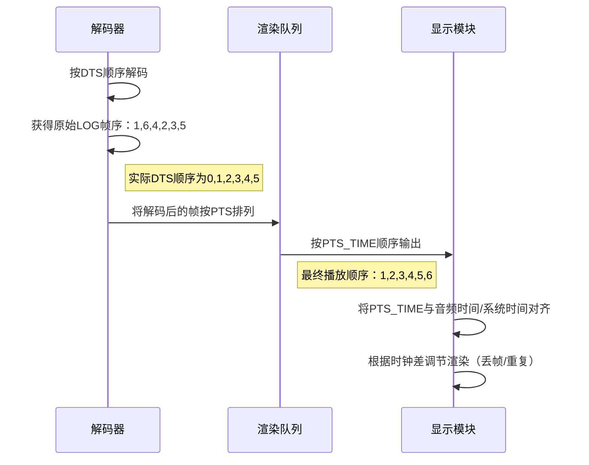
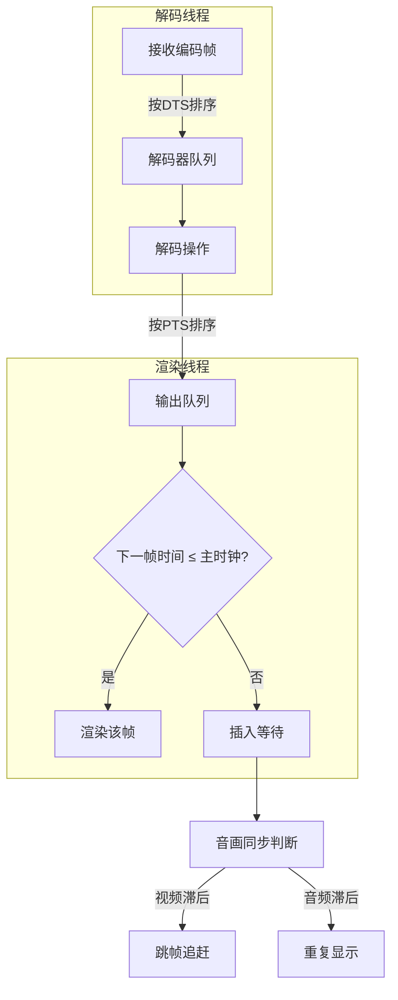

# 时间/timing


好的，我将以结构化方式为您详细讲解这个音视频同步的知识体系，并配合实际案例帮助理解：

---
### **一、核心概念解析**
#### 1. **时间基（Timebase）**
- **定义**：FFmpeg中使用的时间单位，类似"1秒=1000毫秒"中的"毫秒"概念
- **数学表达**：`timebase = 1/timescale`
- **示例**：
  - `timebase=1/60000` 表示每个时间单位是1/60000秒（即1毫秒）
  - `timebase=1/60` 表示每个时间单位是1/60秒（约16.67毫秒）

#### 2. **呈现时间戳（PTS）**
- **作用**：决定视频帧何时应该被**显示**
- **计算规则**：`PTS_TIME = PTS * timebase`
- **递增规律**：`PTS增量 = timescale / fps`
- **示例**：
  ```js
  // fps=60, timebase=1/60000
  timescale = 60000
  每帧间隔 = 60000/60 = 1000时间单位
  PTS序列：0, 1000, 2000...
  实际时间：0ms, 16.67ms, 33.33ms...
  ```

#### 3. **解码时间戳（DTS）**
- **作用**：决定视频帧何时需要被**解码**
- **与PTS的关系**：在存在B帧时会出现差异（后文详解）

#### 4. **帧类型**
- **I帧**：关键帧，完整图像数据
- **P帧**：向前预测帧，依赖前一个I/P帧
- **B帧**：双向预测帧，依赖前后帧（导致解码顺序≠显示顺序）




---
### **二、关键计算逻辑**
#### 1. 时间单位转换公式
```
实际时间 = PTS × timebase
        = PTS / timescale
```

#### 2. 帧间隔计算
```
时间单位增量 = timescale / fps
```

#### 3. FFmpeg参数对应关系
```c
AVStream->avg_frame_rate // 平均帧率（用于计算PTS）
AVStream->r_frame_rate   // 实际帧率（可能含丢帧）
AVStream->time_base      // 时间基参数
```

---
### **三、案例深度解析**
#### 案例1：fps=60, timebase=1/60000
```
timescale = 60000
帧间隔 = 60000/60 = 1000时间单位
PTS序列：0, 1000, 2000...
实际时间：0ms, 16.67ms, 33.33ms...
```

#### 案例2：fps=25, timebase=1/75
```
timescale = 75
帧间隔 = 75/25 = 3时间单位
PTS序列：0, 3, 6, 9...
实际时间：0ms, 40ms, 80ms, 120ms...
```

#### 案例3：存在B帧的DTS/PTS差异
原始日志：
```
Frame1: PTS6000(DTS0)  // I帧
Frame6: PTS11000(DTS1) // P帧
Frame4: PTS9000(DTS2)  // B帧
Frame2: PTS7000(DTS3)  // B帧
Frame3: PTS8000(DTS4)  // B帧
Frame5: PTS10000(DTS5) // B帧
```
解码顺序（DTS顺序）：1 → 6 → 4 → 2 → 3 → 5  
显示顺序（PTS顺序）：1 → 2 → 3 → 4 → 5 → 6

---
### **四、播放器工作原理**
1. **解码队列管理**
   - 按DTS顺序解码帧
   - 将解码后的帧按PTS顺序存入渲染队列

2. **同步机制**
   - 比较音频PTS_TIME和视频PTS_TIME
   - 动态调整渲染时机：
     - 视频超前：等待或丢帧
     - 视频滞后：加速渲染

3. **B帧处理流程**
   - 需要缓存后续的P帧才能解码B帧
   - 典型处理步骤：
     1. 收到I帧（DTS0）立即解码
     2. 收到P帧（DTS1）解码
     3. 用I+P帧解码B帧（DTS2-4）




---
### **五、开发注意事项**
4. **时间基转换**：所有时间计算必须统一到相同时间基准
5. **缓冲区管理**：B帧需要至少2个参考帧缓冲区
6. **异常处理**：
   - 处理PTS回滚（直播流常见）
   - 处理时间戳跳跃（网络丢包时）

---
### **六、调试技巧**
7. 打印关键参数：
```js
console.log(`Stream timebase: ${stream.time_base}`);
console.log(`Frame ${frameNum} PTS:${pts} DTS:${dts}`);
```

8. 可视化工具：
- FFmpeg的`ffprobe`分析时间戳
- Chrome的Media Inspector查看播放时序

通过这个知识体系，您可以理解播放器如何通过时间戳实现音视频同步。实际开发中需要特别注意时间基转换和B帧处理，这些是保证流畅播放的关键。