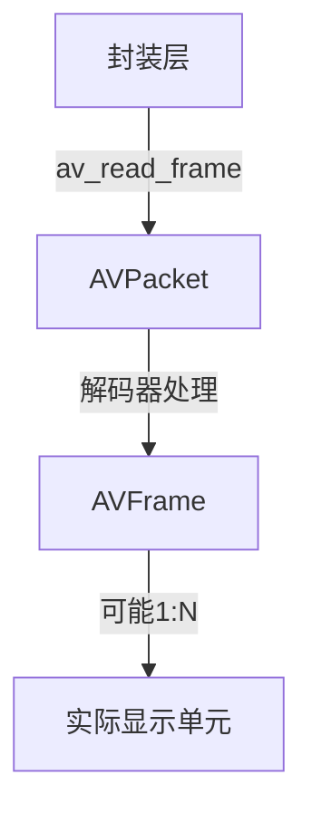
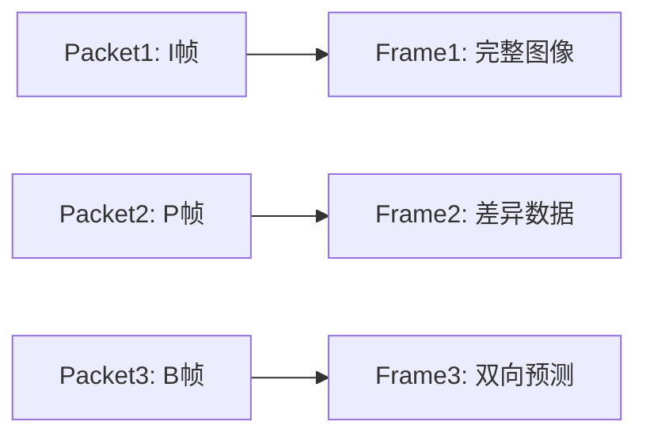
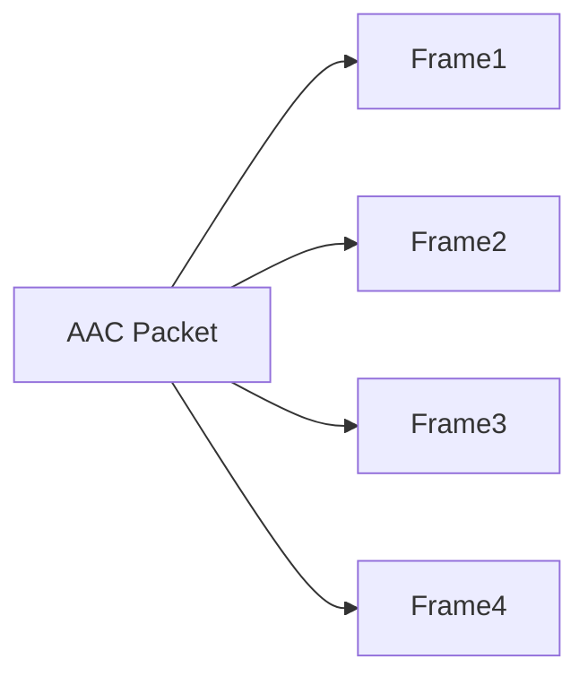

# 入门
在音视频编解码处理中，AVPacket和AVFrame是FFmpeg中两个非常重要的数据结构，它们的分配和使用是解码过程中的关键步骤。让我用通俗易懂的方式解释它们的必要性：

1. **数据流动的阶段性**：
- AVPacket（数据包）：相当于未拆封的快递包裹，**存储着压缩后的编码数据（如H.264/H.265视频数据）**
- AVFrame（帧）：相当于拆封后的物品，存储解码后的原始数据（如YUV/RGB像素数据或PCM音频数据）

2. **解码过程的分工**：


1. **AVPacket的作用**：
- 存储从输入源（如MP4文件）读取的压缩数据包
- 可能包含：
   - **视频：1个视频帧的压缩数据**
   - **音频：多个音频帧的压缩数据（因为音频帧通常较小）**
- 特点：经过编码的、体积较小的二进制数据

2. **AVFrame的作用**：
- 存储解码后的原始数据
- 包含：
   - 视频：像素数据（如YUV420格式）
   - 音频：PCM采样数据
- 特点：未经压缩的、体积较大的原始数据

3. **解码器的工作流程**：
```cpp
while(有数据包){
    1. 读取数据包到AVPacket
    2. 将AVPacket发送给解码器
    3. 从解码器提取AVFrame（可能需要多次提取）
    4. 处理/渲染AVFrame
}
```

4. **为什么需要分开分配**：
- 内存管理：编解码器内部需要独立管理输入/输出缓冲区
- 异步处理：解码器可能同时处理多个数据包（如缓冲优化）
- 数据生命周期：数据包和帧的生命周期不同步（一个数据包可能产生多个帧）

5. **实际使用示例**：
```cpp
// 典型解码循环
while (av_read_frame(format_ctx, pPacket) >= 0) {
    if (pPacket->stream_index == video_stream_idx) {
        // 发送压缩数据包到解码器
        avcodec_send_packet(codec_ctx, pPacket);
      
        while (avcodec_receive_frame(codec_ctx, pFrame) >= 0) {
            // 这里得到的就是可用的原始帧数据
            process_frame(pFrame); // 处理/显示/保存帧
        }
    }
    av_packet_unref(pPacket); // 重要：重置数据包
}
```

6. **内存管理注意事项**：
- 必须使用av_frame_alloc()/av_packet_alloc()而不是malloc
- 释放时需要使用对应的free函数（av_frame_free()/av_packet_free()）
- 每次循环后需要用av_packet_unref()重置数据包

关键理解：现代编解码器的工作方式都是基于数据包（packet）和帧（frame）的管道式处理。这种设计可以高效处理实时流数据，支持硬件加速解码，并能优雅处理不同封装格式的输入源。即使有些情况下看似可以直接转换，但保持这两个阶段的分离是保证解码器正常工作的重要前提。


# AVPacket 和 AVFrame的详解


这个问题涉及到编码层和封装层的核心概念差异。让我们用几个关键维度来分析二者的关系：



### 1. **基本定义对比**
|                | AVPacket                          | AVFrame                          |
|----------------|-----------------------------------|----------------------------------|
| **数据状态**   | 压缩后的编码数据                  | 解码后的原始数据                 |
| **所属层级**   | 封装层/编码层                     | 解码层/渲染层                    |
| **内存占用**   | 较小（如H.264视频帧约几KB~几百KB）| 较大（如1080p YUV帧约3MB）       |
| **时间信息**   | 包含DTS（解码时间戳）             | 包含PTS（显示时间戳）            |
| **空间信息**   | 无                                | 包含宽度/高度/像素格式等         |

### 2. **对应关系分析**
#### 视频流典型情况：


#### 音频流典型情况：


### 3. **关键差异点**
- **视频流**：
  - **通常1个Packet对应1个Frame（H.264/H.265等）**
  - 例外情况：某些编码格式的SEI信息或GOP头可能不产生可视帧

- **音频流**：
  - **1个Packet通常包含多个Frame（如AAC格式每个Packet含1024个采样帧）**
  - 例如：48kHz音频的1个Packet可能包含约21ms的音频数据（1024/48000≈0.021秒）

### 4. **解码过程示例
以H.264视频解码为例：
```c
av_read_frame(format_ctx, pPacket); // 读取一个视频Packet

// 发送到解码器
avcodec_send_packet(codec_ctx, pPacket);

// 接收可能产生的帧
while (avcodec_receive_frame(codec_ctx, pFrame) >= 0) {
    // 这里每个pFrame对应一个可视视频帧
    // 例如：一个I帧Packet会产生一个完整帧
    // 但某些编码配置可能导致一个Packet产生多个帧（如B帧延迟输出）
}
```

### 5. **为什么需要这种设计？
- **编码效率**：视频压缩算法需要前后帧参考（如P帧依赖前帧）
- **传输优化**：音频小帧打包发送更高效
- **硬件兼容**：GPU解码器通常要求以Packet为单位输入
- **流式处理**：支持实时流媒体的分块处理

### 6. **实际数据观察
可以通过打印关键信息来理解二者的关系：
```c
// 打印Packet信息
printf("Packet: stream=%d, size=%d, dts=%ld, flags=%d\n",
       pPacket->stream_index,
       pPacket->size,
       pPacket->dts,
       pPacket->flags);

// 打印Frame信息 
printf("Frame: format=%d, width=%d, height=%d, pts=%ld\n",
       pFrame->format,
       pFrame->width,
       pFrame->height,
       pFrame->pts);
```

### 7. **特殊案例说明
- **B帧问题**：解码器可能暂存多个Packet后才输出Frame（由于双向预测需要后续帧）
- **首帧延迟**：某些编码格式需要发送多个Packet才能得到第一个Frame（如HEVC的VPS/SPS/PPS）
- **音频交错**：一个Packet中的多个音频Frame需要拆解处理

关键结论：**Packet是编码层的传输单元，Frame是解码后的呈现单元**。它们的关系取决于具体的编码格式和封装方式，理解这种1:1、1:N、N:1的灵活对应关系，是掌握音视频处理的核心要点。