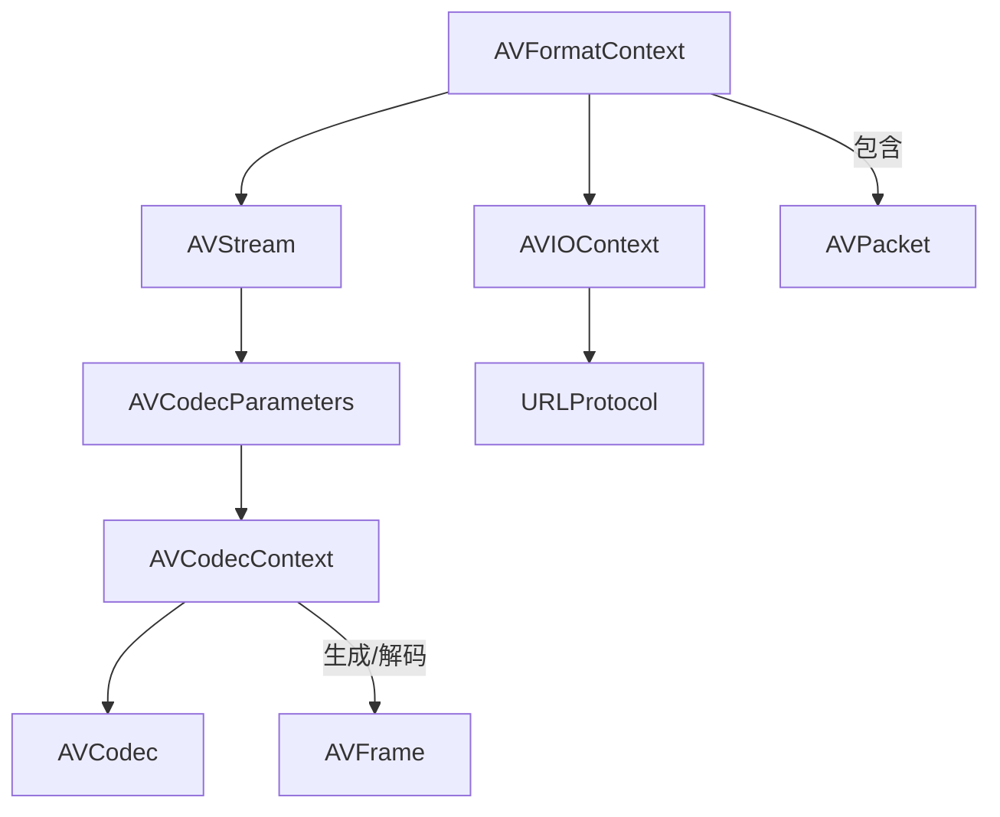

# 1. **AVFormatContext**


AVFormatContext 是 FFmpeg 中处理媒体容器格式的核心结构体，负责封装输入/输出的格式上下文信息。以下是其重要成员及常见参数的详细说明：

---

### **1. 核心成员**
#### **`struct AVInputFormat *iformat`**
- **作用**：指向输入格式的 `AVInputFormat` 结构体（如 MP4、FLV 等）。
- **常见参数**：由 `avformat_open_input()` 自动填充，无需手动设置。
- **示例**：读取文件时自动识别格式。

#### **`struct AVOutputFormat *oformat`**
- **作用**：指向输出格式的 `AVOutputFormat` 结构体。
- **常见参数**：需通过 `av_guess_format()` 或手动指定（如 `avformat_alloc_output_context2()`）。
- **示例**：设置输出为 MP4 格式。

#### **`AVIOContext *pb`**
- **作用**：管理 I/O 操作的上下文（如文件、网络流）。
- **关键参数**：
  - `unsigned char *buffer`：I/O 缓冲区。
  - `int buffer_size`：缓冲区大小。
- **用途**：自定义 I/O 时通过 `avio_alloc_context()` 初始化。

---

### **2. 流与时间信息**
#### **`unsigned int nb_streams`**
- **作用**：媒体流（音频、视频等）的数量。
- **访问方式**：通过 `avformat_find_stream_info()` 自动填充。

#### **`AVStream **streams`**
- **作用**：存储所有媒体流的数组指针。
- **关键操作**：
  - 通过 `avformat_new_stream()` 添加新流。
  - 通过索引访问流（如 `streams[0]` 为第一个流）。

#### **`int64_t duration`**
- **作用**：媒体总时长（单位：`AV_TIME_BASE`，默认为微秒）。
- **获取方式**：调用 `avformat_find_stream_info()` 后自动计算。

#### **`int64_t bit_rate`**
- **作用**：媒体文件的全局比特率（单位：bps）。
- **注意**：可能为 0（如可变码率文件）。

---

### **3. 元数据与配置**
#### **`AVDictionary *metadata`**
- **作用**：存储文件的元数据（如标题、作者）。
- **操作**：
  - 使用 `av_dict_set()` 添加元数据。
  - 通过 `av_dict_get()` 读取元数据。

#### **`int64_t start_time`**
- **作用**：媒体起始时间戳（单位：`AV_TIME_BASE`）。
- **常见值**：0（默认）或文件实际起始时间。

---

### **4. 格式探测与控制**
#### **`int probesize`**
- **作用**：格式探测时读取的最大数据量（字节）。
- **调整场景**：大文件快速探测（设为较小值）或复杂格式（增大值）。

#### **`int max_analyze_duration`**
- **作用**：格式分析的最大时长（微秒）。
- **调整场景**：控制 `avformat_find_stream_info()` 耗时。

---

### **5. 输出控制（Muxing）**
#### **`int64_t max_delay`**
- **作用**：Muxing 时的最大延迟（微秒）。
- **默认值**：`AVFMT_MAX_DELAY`（约 7 秒）。
- **用途**：控制数据包写入的实时性。

#### **`int flags`**
- **作用**：全局标志位。
- **常见标志**：
  - `AVFMT_FLAG_GENPTS`：自动生成缺失的 PTS。
  - `AVFMT_FLAG_FLUSH_PACKETS`：立即输出数据包。
  - `AVFMT_NOFILE`：表示不使用默认 I/O（如自定义输出）。

---

### **6. 时间戳处理**
#### **`int correct_ts_overflow`**
- **作用**：是否自动修正时间戳溢出（32位到64位）。
- **默认值**：1（启用），处理长视频时需保持开启。

---

### **7. 加密与安全**
#### **`uint8_t *key` / `int keylen`**
- **作用**：解密密钥及长度。
- **用途**：处理加密流（如某些 RTMPE 流）。

---

### **8. 其他重要成员**
#### **`AVProgram **programs`**
- **作用**：存储节目信息（如 TS 流中的多节目）。
- **访问方式**：通过 `av_find_program_from_stream()` 获取。

#### **`int error_recognition`**
- **作用**：错误检测级别。
- **标志**：`AV_EF_EXPLODE`（严格检测，出错时立即终止）。

---

### **示例代码（初始化与释放）**
```cpp
AVFormatContext *fmt_ctx = nullptr;

// 打开输入文件
avformat_open_input(&fmt_ctx, "input.mp4", nullptr, nullptr);
avformat_find_stream_info(fmt_ctx, nullptr);

// 输出上下文初始化
avformat_alloc_output_context2(&fmt_ctx, nullptr, "mp4", "output.mp4");
AVStream *stream = avformat_new_stream(fmt_ctx, nullptr);

// 释放资源
avformat_close_input(&fmt_ctx);
avformat_free_context(fmt_ctx);
```

---

### **注意事项**
1. **生命周期管理**：使用 `avformat_close_input()` 和 `avformat_free_context()` 避免内存泄漏。
2. **线程安全**：AVFormatContext 非线程安全，需自行同步。
3. **参数兼容性**：不同格式（如 MP4 与 FLV）支持的参数可能不同，需参考具体封装格式的文档。

通过合理配置这些成员，可以实现高效的媒体文件解析、转码与封装。


# 2. **AVInputFormat 与 AVOutputFormat**
**作用**：描述输入（解复用）/输出（复用）格式的详细信息（如 MP4 的格式规范）。
**常用成员**：

| 成员名称      | 类型            | 说明                                     | 参数选择建议                                 |
|---------------|-----------------|------------------------------------------|---------------------------------------------|
| `name`        | `const char*`   | 格式短名称（如 "mp4"、"flv"）            | 查找时通过 `av_find_input_format("mp4")` 获取 |
| `long_name`   | `const char*`   | 格式完整名称（如 "MP4 (MPEG-4 Part 14)"）| 用于日志或调试显示。                        |
| `extensions`  | `const char*`   | 支持的扩展名（如 "mp4,m4a,m4v"）         | 通过扩展名匹配格式时使用。                  |

**典型场景**：使用 `AVOutputFormat` 创建自定义输出时，需通过 `avformat_alloc_output_context2()` 选择格式类型。

---

# 3. **AVStream**
**作用**：表示单个媒体流（如一个视频流或音频流）。
**常用成员**：

| 成员名称          | 类型                  | 说明                                                   | 参数选择建议                                                                 |
|-------------------|-----------------------|--------------------------------------------------------|-----------------------------------------------------------------------------|
| `index`           | `int`                 | 流的索引（从 0 开始）                                   | 用于关联 `AVPacket` 的 `stream_index`。                                     |
| `time_base`       | `AVRational`          | 时间基（如 `{1, 1000}` 表示时间单位为毫秒）             | 输入流由文件决定，输出流应与编解码器时间基一致（如视频流为帧率倒数）。     |
| `codecpar`        | `AVCodecParameters*`  | 编解码参数（取代旧版 `AVCodecContext* codec`）          | 使用 `avcodec_parameters_copy()` 从输入流复制到输出流。                     |
| `avg_frame_rate`  | `AVRational`          | 平均帧率（如 `{25, 1}` 表示 25fps）                     | 对于变帧率视频可能不准确，需结合 `r_frame_rate`。                           |

---

# 4. **AVCodecContext**
**作用**：编解码器的上下文，存储编解码所需参数和状态。
**常用成员**：
（优先使用 `AVCodecParameters`）

|**场景**|**推荐结构体**|
|---|---|
|获取/设置**流参数**|`AVCodecParameters`|
|配置**编解码器行为**|`AVCodecContext`|

| 成员名称           | 类型                   | 说明                                                    | 参数选择建议                                                                 |
|--------------------|------------------------|---------------------------------------------------------|-----------------------------------------------------------------------------|
| `codec_type`       | `enum AVMediaType`     | 媒体类型（如 `AVMEDIA_TYPE_VIDEO`, `AVMEDIA_TYPE_AUDIO`）| 需与 `AVCodec` 的 `type` 一致。                                              |
| `codec_id`         | `enum AVCodecID`       | 编解码器 ID（如 `AV_CODEC_ID_H264`, `AV_CODEC_ID_AAC`）  | 视频编码选 H.264 (`AV_CODEC_ID_H264`)；音频编码选 AAC (`AV_CODEC_ID_AAC`)。 |
| `bit_rate`         | `int64_t`              | 码率（单位：bps）                                       | 视频码率建议：1080p 用 4000-8000kbps；音频码率常用 128kbps。                |
| `width/height`     | `int`                  | 视频分辨率                                              | 必须为编解码器支持的值（如 H.264 要求宽高是 2 的倍数）。                    |
| `pix_fmt`          | `enum AVPixelFormat`   | 像素格式（如 `AV_PIX_FMT_YUV420P`）                     | 需与输入帧格式一致，且目标编解码器支持。                                    |
| `sample_rate`      | `int`                  | 音频采样率（如 44100Hz）                                | 必须与输入音频一致，输出时若格式不匹配需重采样。                            |
| `channel_layout`   | `uint64_t`             | 音频声道布局（如 `AV_CH_LAYOUT_STEREO`）                | 使用 `av_get_default_channel_layout(nb_channels)` 自动获取布局。            |

---

# 5. **AVCodec 与 AVCodecParameters**
## **AVCodec**
：描述编解码器的能力（如支持的像素格式、最大分辨率）。

| 成员名称        | 类型               | 说明                                  | 示例值                                       |
|-----------------|--------------------|---------------------------------------|---------------------------------------------|
| `name`          | `const char*`      | 编解码器名称（如 "h264"、"aac"）      | 通过 `avcodec_find_encoder(AV_CODEC_ID_H264)` 获取。 |
| `type`          | `AVMediaType`      | 媒体类型（与 `AVCodecContext->codec_type` 一致） | `AVMEDIA_TYPE_VIDEO`。                      |

## **AVCodecParameters**


以下是对 `AVCodecParameters` 结构体的详细解析，结合 FFmpeg 4.x 的实现，涵盖成员含义、常用值、填充时机及关联函数：

---

### **1. `enum AVMediaType codec_type`**
- **含义**：媒体类型（视频、音频、字幕等）。
- **常用值**：
  - `AVMEDIA_TYPE_VIDEO`（视频流）
  - `AVMEDIA_TYPE_AUDIO`（音频流）
  - `AVMEDIA_TYPE_SUBTITLE`（字幕流）
- **填充时机**：
  - **解复用阶段**：由 `libavformat` 的 demuxer（如 `avformat_open_input` 和 `avformat_find_stream_info`）从容器中读取流信息时填充。
  - **编码阶段**：用户手动设置（如调用 `avcodec_parameters_copy` 或直接赋值）。

---

### **2. `enum AVCodecID codec_id`**
- **含义**：编解码器唯一标识（如 H.264、AAC）。
- **常用值**：
  - `AV_CODEC_ID_H264`（H.264 视频）
  - `AV_CODEC_ID_AAC`（AAC 音频）
- **填充时机**：
  - **解复用阶段**：由 demuxer 解析容器头信息时填充（如 `avformat_find_stream_info`）。
  - **编码阶段**：用户显式指定（如通过 `avcodec_find_encoder` 选择编码器后设置）。

---

### **3. `uint32_t codec_tag`**
- **含义**：四字符编解码器标签（如 `'avc1'` 表示 H.264）。
- **常用值**：容器特定的标签（如 MP4 中的 `avc1`、MOV 中的 `mp4a`）。
- **填充时机**：
  - **解复用阶段**：从容器中直接读取（如 `avformat_find_stream_info`）。
  - **复用阶段**：通过 `av_codec_get_tag` 将 `codec_id` 转换为容器支持的标签。

---

### **4. `int format`**
- **含义**：
  - 视频：像素格式（`AVPixelFormat`，如 `AV_PIX_FMT_YUV420P`）。
  - 音频：采样格式（`AVSampleFormat`，如 `AV_SAMPLE_FMT_FLTP`）。
- **填充时机**：
  - **解复用阶段**：由 demuxer 从容器中读取（可能不准确，实际格式需解码后确定）。
  - **解码阶段**：解码器输出的 `AVFrame` 中会包含实际格式。
  - **编码阶段**：用户手动设置（如通过 `avcodec_parameters_from_context` 从 `AVCodecContext` 复制）。

---

### **5. `int64_t bit_rate`**
- **含义**：平均比特率（单位：bps）。
- **常用值**：如 1.5Mbps 视频对应 `1500000`。
- **填充时机**：
  - **解复用阶段**：从容器头部读取（如 MP4 的 `avg_bitrate` 字段）。
  - **编码阶段**：用户设置或由编码器自动计算。

---

### **6. `int bits_per_coded_sample`**
- **含义**：每个编码样本的位数（如 PCM 音频的位深）。
- **常用值**：16（16-bit PCM）、24（24-bit PCM）。
- **填充时机**：由 demuxer 或编码器设置（如 WAV 解析时填充）。

---

### **7. `int bits_per_raw_sample`**
- **含义**：原始样本的位数（如视频像素的实际位深）。
- **常用值**：8（8-bit 视频）、10（10-bit HDR）。
- **填充时机**：通常由解码器填充（如处理 10-bit H.264 时设置为 10）。

---

### **8. `int profile` 和 `int level`**
- **含义**：编解码器的配置文件和级别（如 H.264 High Profile Level 4.1）。
- **常用值**：
  - Profile：`FF_PROFILE_H264_HIGH`、`FF_PROFILE_AAC_LOW`。
  - Level：如 H.264 的 `30`（对应 Level 3.0）。
- **填充时机**：由 demuxer 从容器中解析（如 `avformat_find_stream_info`）。

---

### **9. `int width` 和 `int height`**
- **含义**：视频帧的宽高（单位：像素）。
- **填充时机**：
  - **解复用阶段**：由 demuxer 从容器中读取（如 `avformat_find_stream_info`）。
  - **编码阶段**：用户手动设置。

---

### **10. `AVRational sample_aspect_ratio`**
- **含义**：像素宽高比（SAR），如 `16:9`。
- **常用值**：`AVRational{1,1}`（方形像素）。
- **填充时机**：由 demuxer 从容器中解析（如 MP4 的 `pasp` 原子）。

---

### **11. `enum AVFieldOrder field_order`**
- **含义**：视频场序（逐行、隔行等）。
- **常用值**：
  - `AV_FIELD_PROGRESSIVE`（逐行扫描）
  - `AV_FIELD_TT`（顶场优先）
- **填充时机**：由 demuxer 或解码器填充（如解析 MPEG-2 流时）。

---

### **12. 颜色参数（`color_range`、`color_primaries`、`color_trc`、`color_space`、`chroma_location`）**
- **含义**：颜色空间元数据（如 BT.709、YCbCr 矩阵）。
- **填充时机**：
  - **解复用阶段**：从容器中读取（如 H.264 的 SPS）。
  - **解码阶段**：解码器可能覆盖容器中的值。

---

### **13. `int video_delay`**
- **含义**：视频解码延迟（B 帧数量）。
- **填充时机**：由解码器设置（如 H.264 的 `max_b_frames`）。

---

### **14. `uint64_t channel_layout` 和 `int channels`**
- **含义**：音频声道布局（如立体声 `AV_CH_LAYOUT_STEREO`）和声道数。
- **填充时机**：
  - **解复用阶段**：由 demuxer 从容器中读取（如 WAV 文件的 `fmt` 块）。
  - **编码阶段**：用户设置或通过 `avcodec_parameters_from_context` 复制。

---

### **15. `int sample_rate`**
- **含义**：音频采样率（如 44100Hz）。
- **填充时机**：由 demuxer 从容器中解析（如 MP3 的采样率字段）。

---

### **16. `int block_align`**
- **含义**：音频块对齐（如每个 PCM 帧的字节数）。
- **填充时机**：由 demuxer 解析（如 WAV 文件的 `block_align` 字段）。

---

### **17. `int frame_size`**
- **含义**：音频每帧样本数（如 AAC 固定为 1024）。
- **填充时机**：由 demuxer 或编码器设置。

---

### **18. `int initial_padding` 和 `int trailing_padding`**
- **含义**：编解码器延迟所需的初始/结尾填充样本数。
- **填充时机**：由解码器或编码器设置（如 Opus 编码的初始延迟）。

---

### **19. `int seek_preroll`**
- **含义**：寻址前需要跳过的样本数（用于流同步）。
- **填充时机**：由 demuxer 或编码器设置。

---

### **关键函数与操作流程**

#### **解复用阶段**
- **`avformat_open_input`**：打开输入文件，初始化 `AVFormatContext`。
- **`avformat_find_stream_info`**：读取流信息并填充 `AVStream->codecpar`。
- **`av_read_frame`**：读取数据包，但不会修改 `AVCodecParameters`。

#### **编码/解码阶段**
- **`avcodec_parameters_to_context`**：将 `AVCodecParameters` 复制到 `AVCodecContext`（用于解码器初始化）。
- **`avcodec_parameters_from_context`**：从 `AVCodecContext` 复制参数到 `AVCodecParameters`（用于复用或参数传递）。

#### **复用阶段**
- **`avformat_new_stream`**：创建新流并初始化 `AVCodecParameters`。
- **`avcodec_parameters_copy`**：复制参数到目标流（如转码时）。

---

### **总结**
- **解复用时**：`AVCodecParameters` 由 `libavformat` 的 demuxer 填充（如 MP4、MKV 解析器）。
- **编码时**：用户手动设置或通过 `avcodec_parameters_from_context` 从 `AVCodecContext` 复制。
- **设计目的**：解耦容器格式（`libavformat`）和编解码器（`libavcodec`），提高模块化。

通过理解这些成员及其填充机制，可以更精准地控制 FFmpeg 的编解码流程，处理媒体文件时避免参数错误。

---

# 6. **AVPacket**
**作用**：存储压缩后的编码数据（如 H.264 NAL 单元、AAC 帧）。
**常用成员**：

| 成员名称           | 类型         | 说明                                             |
| -------------- | ---------- | ---------------------------------------------- |
| `data`         | `uint8_t*` | 压缩数据的指针。                                       |
| `size`         | `int`      | 数据长度（字节）。                                      |
| `pts/dts`      | `int64_t`  | 显示时间戳（Presentation Time Stamp）与解码时间戳，需转换为流的时基。 |
| `stream_index` | `int`      | 关联的流索引（对应 `AVStream->index`）。                  |
| `duration`     | `int64_t`  | 数据包的持续时间（以流的时间基为单位）。                           |

**使用注意**：
- 解码前使用 `av_packet_rescale_ts()` 调整时间戳到解码器时间基。
- 必须调用 `av_packet_unref()` 释放资源。

---

# 7. **AVFrame**
**作用**：存储解码后的原始音频/视频数据（如 YUV 帧、PCM 音频）。
**常用成员**：

| 成员名称          | 类型                   | 说明                                                 |
|-------------------|------------------------|------------------------------------------------------|
| `data`            | `uint8_t*[]`           | 音视频数据指针（视频为 YUV 平面数组，音频为 PCM 数据）。 |
| `linesize`        | `int[]`                | 每行数据的字节数（视频中可能包含对齐填充）。          |
| `width/height`    | `int`                  | 视频分辨率。                                         |
| `format`          | `int`                  | 像素格式（视频，如 `AV_PIX_FMT_YUV420P`）或采样格式（音频，如 `AV_SAMPLE_FMT_FLTP`）。|
| `sample_rate`     | `int`                  | 音频采样率。                                        |
| `nb_samples`      | `int`                  | 音频帧中的样本数量。                                 |
| `pts`             | `int64_t`              | 时间戳（需转换为流的时间基）。                       |

**使用注意**：
- 调用 `av_frame_alloc()` 创建，使用后通过 `av_frame_free()` 释放。
- 视频帧需对齐（使用 `av_frame_get_buffer()` 分配内存）。

---

# 8. **AVIOContext、URLProtocol、URLContext**
**AVIOContext**：封装自定义 IO 操作（如内存或网络读取）。

| 成员名称          | 类型               | 说明                             | 使用场景                                     |
|-------------------|--------------------|----------------------------------|---------------------------------------------|
| `buffer`          | `unsigned char*`   | IO 操作的缓冲区。                | 用自定义回调（如从内存读取）时需手动分配。   |
| `read_packet`     | 回调函数           | 自定义数据读取函数。             | 通过 `avio_alloc_context()` 指定回调。       |

**URLProtocol**：协议实现（如 `file`、`http`、`rtmp`）。开发者一般无需直接操作。

**典型自定义 IO 示例**：
```c
AVIOContext *avio_ctx = avio_alloc_context(
    buffer, buffer_size, 0, user_data, read_packet, NULL, seek
);
```

---

# 结构体关系图


---

# 典型参数设置示例
**视频编码器初始化**：
```c
AVCodecContext *enc_ctx = avcodec_alloc_context3(codec);
enc_ctx->bit_rate = 6000000;
enc_ctx->width = 1920;
enc_ctx->height = 1080;
enc_ctx->time_base = (AVRational){1, 25}; // 25fps
enc_ctx->framerate = (AVRational){25, 1};
enc_ctx->pix_fmt = AV_PIX_FMT_YUV420P;
```

**音频重采样参数**：
```c
swr_alloc_set_opts(swr_ctx, 
    target_channel_layout, target_sample_fmt, target_sample_rate,
    src_channel_layout, src_sample_fmt, src_sample_rate, 
    0, NULL);
```

---

**提醒**：建议使用 FFmpeg 4.0+ 的新 API（如 `AVCodecParameters` 替代旧版 `codec` 成员），避免已废弃的函数（如 `avcodec_decode_video2`）。