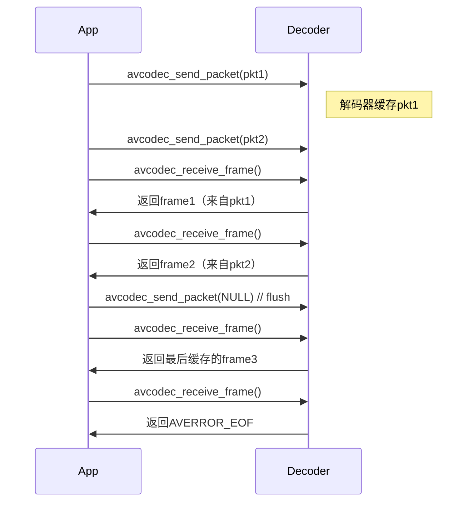
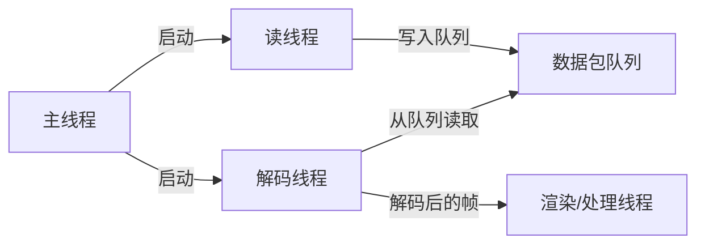

# 入门
好的，我来详细解析这两个关键函数的工作原理和使用方式。这是FFmpeg新型编解码API的核心，理解它们的工作机制对正确进行音视频解码至关重要。

---

### **函数功能定位**


---
### **1. avcodec_send_packet()**
**函数原型**：
```c
int avcodec_send_packet(AVCodecContext *avctx, const AVPacket *avpkt);
```

#### **核心作用**：
- 将压缩数据包送入解码器的输入缓冲区
- 类似"喂食"动作，把原材料（压缩数据）送入解码器

#### **参数解析**：
| 参数    | 说明                                                                 |
|---------|----------------------------------------------------------------------|
| avctx   | 已初始化的编解码上下文                                               |
| avpkt   | 包含压缩数据的包（可传NULL触发flush操作）                            |

#### **返回值处理**：
| 返回值  | 含义                                                                 |
|---------|----------------------------------------------------------------------|
| 0       | 成功接收数据包                                                       |
| EAGAIN  | 解码器缓冲区已满，需要先接收帧（调用receive_frame）                  |
| AVERROR_EOF | 解码器已刷新，不能再发送新数据                                      |
| 其他错误 | 严重错误（如编解码器未打开、内存不足等）                            |

#### **关键特性**：
- 支持异步：函数返回成功仅表示数据包被缓存，不保证立即解码
- 缓冲区管理：解码器内部维护输入队列（通常可容纳多个packet）
- 空包处理：发送NULL packet会触发解码器flush（处理缓存的剩余数据）

---

### **2. avcodec_receive_frame()**
**函数原型**：
```c
int avcodec_receive_frame(AVCodecContext *avctx, AVFrame *frame);
```

#### **核心作用**：
- 从解码器获取解码后的帧数据
- 类似"收获"动作，取出解码器处理完成的成品

#### **参数解析**：
| 参数    | 说明                              |
|---------|-----------------------------------|
| avctx   | 编解码上下文                      |
| frame   | 用于接收解码后帧数据的结构体指针  |

#### **返回值处理**：
| 返回值  | 含义                                     |
|---------|------------------------------------------|
| 0       | 成功获取一个帧                           |
| EAGAIN  | 当前没有可用的帧，需要发送更多packet      |
| AVERROR_EOF | 解码器已完全刷新，没有更多数据          |
| 其他错误 | 解码错误（如损坏数据、硬件错误等）       |

#### **关键特性**：
- 可能多次调用：一个packet可能产生多个frame（常见于音频解码）
- 时间戳处理：自动将解码器时间戳转换为流时间基
- 内存管理：返回的frame内部由解码器管理，不需要手动分配

---

### **3. 典型工作流程**


---

### **4. 完整解码循环示例**
```c
AVPacket *pkt = av_packet_alloc();
AVFrame *frame = av_frame_alloc();

while (1) {
    int ret = av_read_frame(format_ctx, pkt);
    if (ret < 0) break; // 读取结束或错误

    if (pkt->stream_index == target_stream_index) {
        // 发送数据包到解码器
        ret = avcodec_send_packet(codec_ctx, pkt);
        if (ret < 0 && ret != AVERROR(EAGAIN)) {
            // 处理错误
            break;
        }

        // 接收所有可能的解码帧
        while (ret >= 0) {
            ret = avcodec_receive_frame(codec_ctx, frame);
            if (ret == AVERROR(EAGAIN) || ret == AVERROR_EOF)
                break;
            if (ret < 0) {
                // 处理解码错误
                break;
            }

            // 成功获取帧，处理frame数据
            process_frame(frame);
          
            av_frame_unref(frame); // 重要：重置frame
        }
    }
    av_packet_unref(pkt); // 重置packet
}

// 处理残留数据（flush解码器）
avcodec_send_packet(codec_ctx, NULL);
while (avcodec_receive_frame(codec_ctx, frame) >= 0) {
    process_frame(frame);
    av_frame_unref(frame);
}

// 清理资源
av_packet_free(&pkt);
av_frame_free(&frame);
```

---

### **5. 关键注意事项**
1. **EAGAIN处理**：
   - 当`avcodec_send_packet`返回EAGAIN时，必须先调用`avcodec_receive_frame`清空输出缓冲区
   - 当`avcodec_receive_frame`返回EAGAIN时，需要发送更多packet

2. **时间戳转换**：
   ```c
   // 将帧的PTS转换为秒
   double pts_seconds = frame->pts * av_q2d(input_stream->time_base);
   ```

3. **多线程解码**：
   - 设置`codec_ctx->thread_count = 0`自动选择最佳线程数
   - 需要确保线程安全，避免同时操作解码上下文

4. **硬件加速**：
   - 使用硬件解码时，返回的frame可能包含GPU内存指针
   - 需要特殊处理（如使用av_hwframe_transfer_data()复制到CPU内存）

5. **B帧处理**：
   - 解码器可能延迟输出帧（需要后续packet才能解码B帧）
   - 最后的flush操作至关重要，否则可能丢失缓存的帧

---

### **6. 调试技巧**
在解码循环中添加调试输出：
```c
printf("Sent packet: pts=%ld, dts=%ld, size=%d\n",
       pkt->pts, pkt->dts, pkt->size);

printf("Received frame: pts=%ld, width=%d, height=%d\n",
       frame->pts, frame->width, frame->height);
```

---

通过这种"生产-消费"模式的设计，FFmpeg实现了：
- 高效的流水线处理
- 更好的资源控制
- 对复杂编码格式（如B帧、分层编码）的完善支持
- 跨平台/硬件的统一接口

理解这两个函数的配合使用，是掌握FFmpeg解码流程的关键所在。实际开发中建议结合具体编解码器的文档，处理可能出现的特殊边界情况。


# 多线程思考


在 FFmpeg 的实际应用中，`av_read_frame` 和 `av_send_packet` 的异步或多线程处理取决于具体场景和性能需求。以下是详细分析：

---

### 一、**同步与异步的本质**
1. **FFmpeg API 的同步性**
   `av_read_frame`（读取数据包）和 `av_send_packet`（发送到解码器）本身是**同步阻塞**操作：
   - `av_read_frame` 会阻塞直到读取到一个完整的数据包。
   - `av_send_packet` 会阻塞直到解码器准备好接收数据。

2. **异步需要开发者实现**
   FFmpeg 不直接提供异步 API，但可以通过以下模式实现异步：
   - **多线程分离 I/O 和解码**
   - **队列缓冲机制**
   - **事件驱动架构**（如结合 `epoll`/`kqueue` 等）

---

### 二、**典型的多线程模型**
以下是常见的优化架构：



#### 1. **读线程（I/O 密集型）**
- **职责**：调用 `av_read_frame` 读取数据包。
- **优化点**：
  - 对网络流或高延迟存储（如 HDD）特别有用。
  - 通过队列缓冲避免解码线程等待 I/O。

#### 2. **解码线程（CPU 密集型）**
- **职责**：从队列取数据包，调用 `av_send_packet` + `av_receive_frame` 解码。
- **优化点**：
  - 可并行多个解码线程（如分离音视频）。
  - 硬件解码（如 CUDA/VAAPI）可能需专用线程。

---

### 三、**何时需要异步/多线程？**
| 场景 | 是否需要多线程 | 原因 |
|------|----------------|------|
| **本地文件播放** | 可选 | I/O 延迟低，单线程可能足够 |
| **网络流媒体** | 推荐 | 避免网络抖动导致卡顿 |
| **实时处理（如直播）** | 必需 | 严格保障吞吐量和延迟 |
| **4K/8K 高清解码** | 必需 | 解码压力大，需并行化 |

---

### 四、**关键注意事项**
1. **线程安全**
   - FFmpeg 的 `AVFormatContext`、`AVCodecContext` 等结构**非线程安全**。
   - 需通过锁或队列隔离资源（例如：为读线程和解码线程分配独立的 `AVPacket` 队列）。

2. **队列设计**
   ```c
   // 伪代码示例：线程安全队列
   ThreadSafeQueue<AVPacket*> packet_queue;
 
   // 读线程
   while (av_read_frame(format_ctx, packet) >= 0) {
       packet_queue.push(clone_packet(packet)); // 必须深拷贝
   }
 
   // 解码线程
   while (AVPacket *pkt = packet_queue.pop()) {
       av_send_packet(codec_ctx, pkt);
       av_packet_unref(pkt);
   }
   ```

3. **性能权衡**
   - 线程数过多可能导致上下文切换开销。
   - 建议通过性能测试工具（如 `perf`、`vtune`）分析瓶颈。

---

### 五、**替代方案**
4. **异步 I/O + 事件循环**
   结合 `libuv` 或 `libevent` 实现非阻塞 I/O，但需要修改 FFmpeg 的数据源（如自定义 `AVIOContext`）。

5. **FFmpeg 的多线程解码**
   启用编解码器的多线程参数：
   ```c
   codec_ctx->thread_count = 4; // 解码器内部多线程
   codec_ctx->thread_type = FF_THREAD_FRAME;
   ```

---

### 总结
- **默认同步**：简单场景可直接单线程调用。
- **高负载场景**：通过多线程分离 I/O、解码、渲染阶段。
- **关键点**：合理设计队列、深拷贝数据包、避免资源竞争。